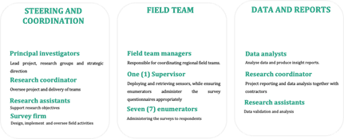
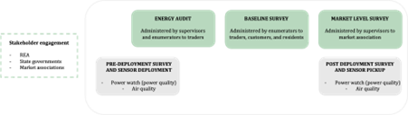
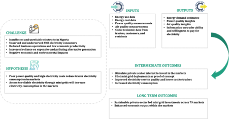
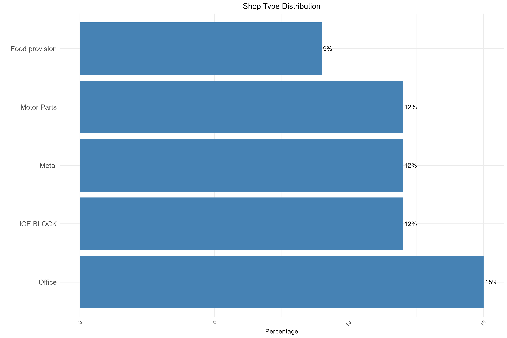
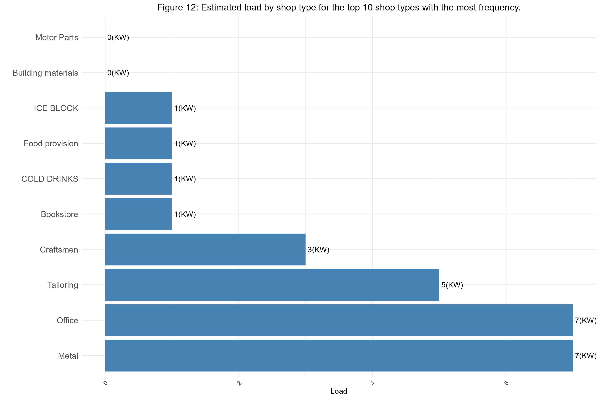

```{r setup, include=FALSE}
knitr::opts_chunk$set(echo = TRUE, message=FALSE, warning=FALSE)

options(knitr.table.format = function() {
  if (knitr::is_latex_output())
    "latex" else "pipe"
})

knitr::opts_chunk$set(echo = FALSE,
                      message=FALSE, warning=FALSE)
```


```{r library, include=FALSE}
library(readxl)
library(readr)
library(knitr)
library(kableExtra)
library(stringr)
library(dplyr)
library(tidyr)
library(janitor)
library(flextable)
library(lubridate)
library(forcats)
library(data.table)
library(forcats)
library(ggplot2)
library(glue)
# install.packages("googledrive")
# install.packages("readr")  # Assuming you want to read CSV files
library(googledrive)
library(readr)
drive_auth()
```


```{r}
# audit_data <- read_excel("../Audit.xlsx")
# baseline_data <-  read_excel( "../Baseline.xlsx")
# baseline_others_data <-  read_excel( "../Baseline_others.xlsx")
# powerwatch_data <-  read_excel( "../Powerwatch.xlsx")
# 
# 
# # dim(audit_data)
# # dim(baseline_data)
# # dim(baseline_others_data)
# # dim(powerwatch_data)
# 
# 
# additional_data_market <-  read_excel( "../Additional_data.xlsx", sheet = "Market Level")
# 
# additional_data_state <-  read_excel( "../Additional_data.xlsx", sheet = "State Level")

# dim(additional_data_market)
# dim(additional_data_state)
```

```{r}
# Set the folder ID (the part after "/folders/" in your Google Drive URL)
folder_id <- "1WB9ix8WJKZA7tMWH94_zg78s06YnVVJ2"

# List files in the folder
files_in_folder <- drive_ls(as_id(folder_id))

# Filter for folder_a
market_ini <- files_in_folder[files_in_folder$name == params$market_initial, ]

# List files in folder_a
files_in_folder_a <- drive_ls(as_id(market_ini$id))

# Filter for audit.csv
audit_file <- files_in_folder_a[files_in_folder_a$name == "audit.csv", ]

# Filter for baseline_trader.csv
baseline_trader_file <- files_in_folder_a[files_in_folder_a$name == "baseline_trader.csv", ]

# Filter for baseline_others.csv
baseline_others_file <- files_in_folder_a[files_in_folder_a$name == "baseline_others.csv", ]

# Filter for powerwatch.csv
powerwatch_file <- files_in_folder_a[files_in_folder_a$name == "powerwatch.csv", ]

# Download the .csv files
drive_download(as_id(audit_file$id), path = "audit.csv", overwrite = TRUE)
drive_download(as_id(baseline_trader_file$id), path = "baseline_trader.csv", overwrite = TRUE)
drive_download(as_id(baseline_others_file$id), path = "baseline_others.csv", overwrite = TRUE)
drive_download(as_id(powerwatch_file$id), path = "powerwatch.csv", overwrite = TRUE)

# Read the CSV file
audit_data <- read_csv("audit.csv")
baseline_data <- read_csv("baseline_trader.csv")
baseline_others_data <- read_csv("baseline_others.csv")
powerwatch_data <- read_csv("powerwatch.csv")

market_name_new <- c(levels(as.factor(audit_data$`3. Market Name`)))[1]

# # Display the first few rows of the data
# print(head(audit_data))

```

```{r}
# Filter for folder_a
additional_d <- files_in_folder[files_in_folder$name == "Additional_info", ]

# List files in folder_a
files_in_folder_b <- drive_ls(as_id(additional_d$id))

# Filter for addtional_market.xlsx
additional_market <- files_in_folder_b[files_in_folder_b$name == "addtional_market.xlsx", ]

# Filter for additional_state.xlsx
additional_state <- files_in_folder_b[files_in_folder_b$name == "additional_state.xlsx", ]


# Download the .csv files
drive_download(as_id(additional_market$id), path = "addtional_market.xlsx", overwrite = TRUE)
drive_download(as_id(additional_state$id), path = "additional_state.xlsx", overwrite = TRUE)


additional_data_market <-  read_excel( "addtional_market.xlsx", sheet = "Market Level")

additional_data_state <-  read_excel( "additional_state.xlsx", sheet = "State Level")
```


```{r}
market_audit <- subset(audit_data, `3. Market Name` == market_name_new)
market_baseline <- subset(baseline_data, `1. Market Name` == market_name_new)
market_baseline_others <- subset(baseline_others_data, `2. Market Name (Customer)` == market_name_new)
market_powerwatch <- subset(powerwatch_data, `1. Market Name...14` == market_name_new)

market_additional_data <- subset(additional_data_market, `Market name` == market_name_new)

market_state <- c(levels(as.factor(market_additional_data$State)))


state_additional_data <- subset(additional_data_state, State == market_state)


market_city <- c(levels(as.factor(market_additional_data$City)))

market_LGA <- c(levels(as.factor(market_additional_data$LGA)))

market_distribution_company <- c(levels(as.factor(market_additional_data$`Distribution company`)))

market_tariff_class <- c(levels(as.factor(market_additional_data$`Tariff class`)))

market_tariff_rate <- c(levels(as.factor(market_additional_data$`Tariff rate`)))

market_weekly_power_supply <- c(levels(as.factor(market_additional_data$`Hours of power supply per week (from previous report)`)))

market_description <- c(levels(as.factor(market_additional_data$`Market description`)))

market_association <- c(levels(as.factor(market_additional_data$`Market Association`)))


#powerwatch
number_of_sensors_deployed <- c(market_additional_data$sensors_deployed)
average_deployment_duration <- c(market_additional_data$`avg_deployment_duration (days)`)
average_voltage <- c(market_additional_data$avg_voltage)
average_frequency <- c(market_additional_data$avg_frequency)
average_daily_hour_undervoltage <- c(market_additional_data$avg_hours_undervoltage)
average_daily_minute_undervoltage <- c(market_additional_data$avg_mins_overvoltage)
average_daily_outage_duration <- c(market_additional_data$avg_daily_outage_duration)
average_daily_outage_frequency <- c(market_additional_data$avg_daily_outage_frequency)


```

```{r}
# formatting power watch deployment time

power_watch_deployment_start_time <- c(market_additional_data$power_watch_deployment_start_time)
power_watch_deployment_end_time <- c(market_additional_data$power_watch_deployment_end_time)


#format data collection start date

power_watch_deployment_start_time <- ymd(power_watch_deployment_start_time)

# Extract day, month, and year
market_data_collection_start_day <- day(power_watch_deployment_start_time)
market_data_collection_start_month <- format(power_watch_deployment_start_time, "%B")
market_data_collection_start_year <- year(power_watch_deployment_start_time)


#format data collection end date

power_watch_deployment_end_time <- ymd(power_watch_deployment_end_time)

# Extract day, month, and year
market_data_collection_end_day <- day(power_watch_deployment_end_time)
market_data_collection_end_month <- format(power_watch_deployment_end_time, "%B")
market_data_collection_end_year <- year(power_watch_deployment_end_time)


# Format the date
power_watch_deployment_start_time <- glue("{market_data_collection_start_month} {market_data_collection_start_day}, {market_data_collection_start_year}")

power_watch_deployment_end_time <- glue("{market_data_collection_end_month} {market_data_collection_end_day}, {market_data_collection_end_year}")

```


```{r}
# formatting of data collection date

market_data_collection_start_date <- c(levels(as.factor(market_additional_data$Start_date_of_collection)))

market_data_collection_end_date <- c(levels(as.factor(market_additional_data$End_date_of_collection)))


#format data collection start date

market_data_collection_start_date <- dmy(market_data_collection_start_date)

# Extract day, month, and year
market_data_collection_start_day <- day(market_data_collection_start_date)
market_data_collection_start_month <- format(market_data_collection_start_date, "%B")
market_data_collection_start_year <- year(market_data_collection_start_date)


#format data collection end date

market_data_collection_end_date <- dmy(market_data_collection_end_date)

# Extract day, month, and year
market_data_collection_end_day <- day(market_data_collection_end_date)
market_data_collection_end_month <- format(market_data_collection_end_date, "%B")
market_data_collection_end_year <- year(market_data_collection_end_date)


# Format the date
market_data_collection_start_date <- glue("{market_data_collection_start_month} {market_data_collection_start_day}, {market_data_collection_start_year}")

market_data_collection_end_date <- glue("{market_data_collection_end_month} {market_data_collection_end_day}, {market_data_collection_end_year}")
```

```{r}
# formatting verification time

market_date_verification_start <- c(levels(as.factor(market_additional_data$`Date of verificaiton(Start)`)))

market_date_verification_end <- c(levels(as.factor(market_additional_data$`Date of verificaiton(End)`)))


#format data collection start date

market_date_verification_start <- ymd(market_date_verification_start)

# Extract day, month, and year
market_data_verification_start_day <- day(market_date_verification_start)
market_data_verification_start_month <- format(market_date_verification_start, "%B")
market_data_verification_start_year <- year(market_date_verification_start)


#format data collection end date

market_date_verification_end <- ymd(market_date_verification_end)

# Extract day, month, and year
market_data_verification_end_day <- day(market_date_verification_end)
market_data_verification_end_month <- format(market_date_verification_end, "%B")
market_data_verification_end_year <- year(market_date_verification_end)


# Format the date
market_date_verification_start <- glue("{market_data_verification_start_month} {market_data_verification_start_day}, {market_data_verification_start_year}")

market_date_verification_end <- glue("{market_data_verification_end_month} {market_data_verification_end_day}, {market_data_verification_end_year}")


```


```{r}
# dim(market_audit)
# dim(market_baseline)
# dim(market_baseline_others)
# dim(market_powerwatch)
```

```{r}

# Create a mapping of old values to new values
value_mapping <- c(
  "Bank" = "Bank",
  "Building materials & Paint, Pumping materials and furniture" = "Building materials",
  "Cosmetics, Salon and hairdressing" = "Salon",
  "COLD DRINKS SELLER" = "COLD DRINKS",
  "Craftsmen / Artisans" = "Craftsmen",
  "Drugs/Pharmaceutical" = "Pharmaceutical",
  "Fabrication" = "Fabrication",
  "FROZEN FOODS" = "FROZEN FOODS",
  "Food provision and foods perishable items" = "Food provision",
  "General household Goods" = "household Goods",
  "Large format printing" = "printing",
  "Generator Parts" = "Generator Parts",
  "ICE BLOCK MAKER" = "ICE BLOCK",
  "Jewelry" = "Jewelry",
  "Leather shoes, hand bags and other leather products and clothing" = "Leather",
  "Lighting, electrical and communications items" = "electrical",
  "Laundy" = "Laundy",
  "Motorcycle Parts" = "Motorcycle Parts",
  "Motor Parts" = "Motor Parts",
  "Office" = "Office",
  "Paper" = "Paper",
  "Optics/ Eyeglasses" = "Optics",
  "Printer" = "Printer",
  "Public Toilet" = "Toilet",
  "Religious Center" = "Religious Center",
  "Tailoring / T-Shirts / Clothing" = "Tailoring",
  "Textile" = "Textile",
  "Stationary/ Bookstore" = "Bookstore",
  "Traditional Accessories" = "Traditional Accessories",
  "Welding / Metal Works" = "Metal",
  "Timber / Carpentry" = "Carpentry"
)


# Rename the values in the TYPE column
market_audit <- market_audit %>%
  mutate(SHOP_TYPE_NEW = value_mapping[`13. Shop Type`])
```


**`r paste0(market_name_new)`**


```{r}

convert_excel_date <- function(x) {
  as.Date(as.numeric(x), origin = "1899-12-30")
}

# Function to determine the type of date format and convert accordingly
convert_timestamp <- function(x) {
  # Check if the value is numeric (Excel serial number)
  if (grepl("^[0-9]+\\.?[0-9]*$", x)) {
    return(as.character(convert_excel_date(x)))
  } else {
    # If it's not numeric, assume it's a standard date-time format
    date_time <- mdy_hms(x, tz = "UTC", quiet = TRUE)
    return(as.character(as.Date(date_time)))  # Extract only the date part
  }
}

# Apply the conversion function directly to the character vector

market_timestamp <- sapply(market_audit$Timestamp, convert_timestamp)


# Filter dates before 2023
market_timestamp <- market_timestamp[market_timestamp < as.Date("2023-01-01")]

start_date <- min(market_timestamp)
end_date <- max(market_timestamp)


```


```{r}
# Parse the date start date
start_date <- ymd(start_date)

# Extract day, month, and year
day_start <- day(start_date)
month_start <- format(start_date, "%B")  # Full month name
year_start <- year(start_date)


# Create the formatted date string
formatted_start_date <- glue("{month_start} {day_start} , {year_start}")


# Parse the date end date
end_date <- ymd(end_date)

# Extract day, month, and year
day_end <- day(end_date)
month_end <- format(end_date, "%B")  # Full month name
year_end <- year(end_date)


# Create the formatted date string
formatted_end_date <- glue("{month_end} {day_end} , {year_end}")


```


**`r paste0("This insights presented in this report are from the study conducted from ", market_data_collection_start_date," to ", market_data_collection_end_date, " and verified from ",  market_date_verification_start , " to ",  market_date_verification_end)`**


\newpage


## EXECUTIVE SUMMARY

> `r paste0("The Energizing Economies Initiative (EEI) is a private sector led program launched by the Federal Government of Nigeria (FGN) and implemented by the Rural Electrification Agency (REA). It is aimed at providing clean, reliable, and affordable electricity solutions to economic clusters (markets, shopping complexes and industrial clusters) in Nigeria. To further this objective through a study, eGUIDE, funded by Rockefeller foundation provided expertise to support the REA in conducting baseline surveys, energy audits, and sensor deployments to understand the markets’ status, energy consumption and energy demand across 79 markets in 28 states in Nigeria. Thereafter, private developers with the requisite financial and technical capacity are identified and engaged to develop, operate, and maintain the projects. This report presents insights from the study in ", market_name_new,". It contains a comprehensive analysis of the project objectives, methodology, and project's findings. The first study was conducted from ", market_data_collection_start_date," to ", market_data_collection_end_date, " and a verification exercise to validate occupancy status and shop numbering formats was conducted from ",  market_date_verification_start , " to ",  market_date_verification_end)`


\newpage


```{r}

# market_audit$`18. Shop Opening Time` <- as.POSIXlt(paste(Sys.Date(), market_audit$`18. Shop Opening Time`), format = "%Y-%m-%d %I%p")
# 
# 
# # Function to convert datetime to desired format
# convert_to_time <- function(datetime_str) {
#   # Parse the datetime string
#   dt <- ymd_hms(datetime_str)
#   
#   # Extract the hour and am/pm indicator
#   hour <- hour(dt)
#   period <- ifelse(hour < 12, "am", "pm")
#   
#   # Convert hour to 12-hour format
#   hour <- hour %% 12
#   hour <- ifelse(hour == 0, 12, hour)
#   
#   # Combine hour and period
#   paste(hour, period)
# }
# 
# # Apply the function to the column
# market_audit$`18. Shop Opening Time` <- sapply(market_audit$`18. Shop Opening Time`, convert_to_time)
```

```{r}
get_mode <- function(v) {
  uniqv <- unique(v)
  uniqv[which.max(tabulate(match(v, uniqv)))]
}

# Example usage
example_vector <- c(1, 2, 2, 3, 3, 3, 4, 4, 4, 4)
mode_value <- get_mode(example_vector)


```


```{r}


market_opeining_time_df <- market_audit[market_audit$`18. Shop Opening Time` != "NA" & !is.na(market_audit$`18. Shop Opening Time`), ]

# Format the parsed time as "9 pm"
min_opening_time <- get_mode(market_opeining_time_df$`18. Shop Opening Time`)


market_closing_time_df <- market_audit[market_audit$`19. Shop Closing Time` != "NA" & !is.na(market_audit$`19. Shop Closing Time`), ]

# Format the parsed time as "9 pm"
max_closing_time <- get_mode(market_closing_time_df$`19. Shop Closing Time`)

```


```{r}


occupied_shops <- subset(market_audit, `11. Shop Occupancy Status` == "OCCUPIED")
occupied_shops <- occupied_shops %>% filter(!is.na(`13. Shop Type`))
occupied_shops <- occupied_shops[!occupied_shops$`13. Shop Type` %in% "NA", ]


shops_occupied_and_audited <- nrow(occupied_shops)


# ALL AVAILABLE SPACES(MARKET FACILITY)

no_of_shops <- nrow(market_audit)

occupied_count <- nrow(subset(market_audit, `11. Shop Occupancy Status` == "OCCUPIED"))

percentage_occupancy_all <- round(nrow(subset(market_audit, !(`11. Shop Occupancy Status` %in% c("UNOCCUPIED", "UNDER CONSTRUCTION"))))/nrow(market_audit) * 100, 2)


# SHOPS ONLY 

shops_only <- subset(market_audit, `11. Shop Occupancy Status` %in% c("OCCUPIED", "LOCKED UP", "UNOCCUPIED", "UNDER CONSTRUCTION"))

count_shops_only <- nrow(shops_only)

percentage_occupancy_shops_only <- round(nrow(subset(shops_only, !(`11. Shop Occupancy Status` %in% c("UNOCCUPIED", "UNDER CONSTRUCTION"))))/nrow(shops_only) * 100, 2)


percentage_of_shops_that_make_up_facility <- round((count_shops_only/no_of_shops)*100, 2)
```


```{r}
# MOST COMMON SHOP TYPES / BUSINESS TYPES

shop_type_freq <- occupied_shops %>% group_by(`13. Shop Type`)%>%
                        summarise(count = n(),
                                  Percentage = round(n() / nrow(occupied_shops) * 100, 2)
                                  )%>%
                        arrange(desc(Percentage))
 
high_shop_freq_1 <- shop_type_freq$`13. Shop Type`[1]
percent_high_shop_freq_1 <- paste0(shop_type_freq$Percentage[1],"%")

high_shop_freq_2 <- shop_type_freq$`13. Shop Type`[2]
percent_high_shop_freq_2 <- paste0(shop_type_freq$Percentage[2],"%")


high_shop_freq_3 <- shop_type_freq$`13. Shop Type`[3]
percent_high_shop_freq_3 <- paste0(shop_type_freq$Percentage[3],"%")

```

## Market details and occupancy

> `r paste0("The market occupancy categories include “shops” for business activities which are occupied, unoccupied, under construction, or locked up, and “others” which are bank, residential, school, church, warehouse, police station, fire service, mosque, or shed. In ",market_name_new," market, all classifications of shops make up ", percentage_of_shops_that_make_up_facility,"% of the ",no_of_shops," market facilities. Only occupied shops were audited. These are shops that were open, occupied by a trader conducting business, available for surveys and had an energy audit conducted in them during the study period. ", high_shop_freq_1," shops are the most popular type of shops in ", market_name_new, " market, making up ", percent_high_shop_freq_1," of the total occupied shops. Other top shop types are ",high_shop_freq_2," (", percent_high_shop_freq_2, ") and ",high_shop_freq_3," (", percent_high_shop_freq_3, ").")`


> `r paste0("1. Name of Market: ", market_name_new)`

> `r paste0("2. City: ", market_city)`

> `r paste0("3. Local Government area: ", market_LGA)`

> `r paste0("4. State: ", market_state)`

> `r paste0("5. Distribution Company: ", market_distribution_company)`

> `r paste0("6. Grid Electricity Tariff class: ", market_tariff_class)`

> `r paste0("7. Grid Electricity Tariff Rate: ", market_tariff_rate)`

> `r paste0("8. Market Opening Time: ", min_opening_time)`

> `r paste0("9. Market closing Time: ", max_closing_time)`

> `r paste0("10. Occupancy Rate(Shops): ", percentage_occupancy_shops_only, " %")`

> `r paste0("11. Occupancy Rate(Shops&Others): ", percentage_occupancy_all, " %")`

> `r paste0("12. Total Number of Market facilities: ", no_of_shops)`

> `r paste0("13. Shops occupied and audited: ", shops_occupied_and_audited)`


\newpage


```{r}
occupied_shops$total_required_power <- coalesce(as.double(occupied_shops$`Total - Estimated Power Req . (W)`), 0) + coalesce(as.double(occupied_shops$`Additional Load from Requested Appliances`), 0)

occupied_shops$total_required_power <- coalesce(occupied_shops$total_required_power, 0)


market_required_load <- paste0(round(sum(occupied_shops$total_required_power, na.rm = TRUE)/1000, 0), "KW")


lightening_load <- round(sum(as.double(occupied_shops$`Lighting - Estimated Power Req . (W)`), na.rm = TRUE)/1000, 0)

cooling_load <- round(sum(as.double(occupied_shops$`Cooling - Estimated Power Req . (W)`), na.rm = TRUE)/1000, 0)

others_load <- round(sum(as.double(occupied_shops$`Others - Estimated Power Req . (W)`), na.rm = TRUE)/1000, 0)


shops_with_solar <- nrow(subset(occupied_shops, `62. Is there electricity supply for this shop from a solar panel owned by the shop?` == TRUE))


shops_that_use_gen_count <- nrow(subset(occupied_shops, `35. Is there a supply of electricity from a "merger" generators.` == TRUE)) +
                        nrow(subset(occupied_shops, `39. Is there electricity supply for this shop from "personal" generator?` == TRUE))


shops_that_use_merger_count <- nrow(subset(occupied_shops, `35. Is there a supply of electricity from a "merger" generators.`== TRUE))


shops_with_personal_gen_count <- nrow(subset(occupied_shops, `39. Is there electricity supply for this shop from "personal" generator?` == TRUE))

personal_generator_count_in_market <- sum(as.double(occupied_shops$`40. If yes how many generators do you own and operate?`), na.rm = TRUE)


shops_that_use_grid <- nrow(subset(occupied_shops, `31. Is there a supply of electricity for this shop from the grid utility (local discos/NEPA/PHCN) connected directly to this shop (not a shared connection from outside).` == TRUE)) +
                        nrow(subset(occupied_shops, `52. Is there a supply of electricity for this shop from a grid connection outside of this shop ( "shared" grid connection not connected directly to the shop)` == TRUE))

```


```{r}
# Assuming your dataframe is named occupied_shops
# Extract the column
generator_size <- occupied_shops$`44. What is the size of your primary generator (the one mostly used)? (in KW/KVA)?`

# Identify non-numeric entries
non_numeric_entries <- generator_size[!grepl("^[0-9.]+$", generator_size)]


# Remove or replace non-numeric entries (e.g., convert empty strings to NA)
generator_size_cleaned <- as.numeric(generator_size)

# Calculate the mean, excluding NA values
mean_generator_size_initial <- median(generator_size_cleaned, na.rm = TRUE)


mean_generator_size <- ifelse(mean_generator_size_initial >=1000,  (mean_generator_size_initial/1000), mean_generator_size_initial)
```

## Energy Audit

`r paste0("Load estimates were derived from the number of appliances owned and used per trader in the market and the respective appliance power ratings. These estimates are gathered from a representative section of the market, being only occupied shops in which an energy audit could be conducted. While the load estimates offer an indication of peak loads to guide sizing of power systems, for actual and more precise energy demand estimations, real time monitoring over specific time frames would be required. The lighting load is the sum of all lighting appliances, cooling loads include loads such as fans, refrigerators, and other appliances that provide cooling. In markets where cold rooms exist, these are also added to determine the cooling load. Peak load in the market is estimated at ", market_required_load," based on ", shops_occupied_and_audited, " shops audited. In terms of alternate energy sources, ", shops_with_solar, " shop(s) use stand-alone solar systems. Also in the market, ", shops_that_use_gen_count, " shops were recorded as owning generators with an average generator capacity of ", mean_generator_size, " kVA.")`


> `r paste0("1. Estimated PEAK Load: ", market_required_load)`

> `r paste0("2. Estimated LIGHTENING Load: ", lightening_load, " KW")`

> `r paste0("3. Estimated COOLING Load: ", cooling_load, " KW")`

> `r paste0("4. Estimated Load (OTHERS): ", others_load, " KW")`

> `r paste0("5. Shops with PERSONAL generators: ", shops_with_personal_gen_count)`

> `r paste0("6. PERSONAL generators owned by traders: ", personal_generator_count_in_market)`

> `r paste0("7. Shops with MERGER generators: ", shops_that_use_merger_count)`

> `r paste0("8. Shops with SOLAR POWER systems: ", shops_with_solar)`

> `r paste0("9. Hours of grid electricity supply per week: ", market_weekly_power_supply, " Hours")`


\newpage


```{r}

#GRID SPEND


occupied_shops[,"grid_payment_time"]<- ""
```

```{r}
occupied_shops$`32. How frequent do you pay for this electricity`<- coalesce(occupied_shops$`32. How frequent do you pay for this electricity`, "Nil")
```


```{r}
occupied_shops[occupied_shops$`32. How frequent do you pay for this electricity` == "Daily" , "grid_payment_time"] <- "26"
occupied_shops[occupied_shops$`32. How frequent do you pay for this electricity` == "Monthly" , "grid_payment_time"] <- "1"
occupied_shops[occupied_shops$`32. How frequent do you pay for this electricity` == "Prepaid" , "grid_payment_time"] <- "1"
occupied_shops[occupied_shops$`32. How frequent do you pay for this electricity` == "Quartely" , "grid_payment_time"] <- "0.33"
occupied_shops[occupied_shops$`32. How frequent do you pay for this electricity` == "Quarterly" , "grid_payment_time"] <- "0.33"
occupied_shops[occupied_shops$`32. How frequent do you pay for this electricity` == "Quaterly" , "grid_payment_time"] <- "0.33"
occupied_shops[occupied_shops$`32. How frequent do you pay for this electricity` == "Weekly" , "grid_payment_time"] <- "4"
occupied_shops[occupied_shops$`32. How frequent do you pay for this electricity` == "Yearly" , "grid_payment_time"] <- "0.083"
occupied_shops[occupied_shops$`32. How frequent do you pay for this electricity` == "Nil" , "grid_payment_time"] <- "0"
```

```{r}
occupied_shops$grid_payment_time <- as.double(occupied_shops$grid_payment_time)

occupied_shops$grid_monthly_payment <- as.double(occupied_shops$`33. How Much Do you Pay for grid utility service? (local disco/NEPA/PHCN/etc) (during the payment period you mentioned before)`) * occupied_shops$grid_payment_time
```


```{r}
occupied_shops[,"grid_outside_payment_time"]<- ""
```

```{r}
occupied_shops$`53. how often do you pay for this electricity. (shared grids)`<- coalesce(occupied_shops$`53. how often do you pay for this electricity. (shared grids)`, "Nil")
```


```{r}
occupied_shops[occupied_shops$`53. how often do you pay for this electricity. (shared grids)` == "Daily" , "grid_outside_payment_time"] <- "26"
occupied_shops[occupied_shops$`53. how often do you pay for this electricity. (shared grids)` == "Monthly" , "grid_outside_payment_time"] <- "1"
occupied_shops[occupied_shops$`53. how often do you pay for this electricity. (shared grids)` == "Quarterly" , "grid_outside_payment_time"] <- "0.33"
occupied_shops[occupied_shops$`53. how often do you pay for this electricity. (shared grids)` == "Weekly" , "grid_outside_payment_time"] <- "4"
occupied_shops[occupied_shops$`53. how often do you pay for this electricity. (shared grids)` == "Yearly" , "grid_outside_payment_time"] <- "0.083"
occupied_shops[occupied_shops$`53. how often do you pay for this electricity. (shared grids)` == "Nil" , "grid_outside_payment_time"] <- "0"
```

```{r}
occupied_shops$grid_outside_payment_time <- as.double(occupied_shops$grid_outside_payment_time)

occupied_shops$grid_outside_monthly_payment <- as.double(occupied_shops$`54. how much do you spend on shared grid electricity connection (during the payment period you mentioned before)`) * occupied_shops$grid_outside_payment_time
```

```{r}
occupied_shops$grid_monthly_payment <- coalesce(occupied_shops$grid_monthly_payment, 0)

occupied_shops$grid_outside_monthly_payment <- coalesce(occupied_shops$grid_outside_monthly_payment, 0)
```

```{r}
occupied_shops$total_monthly_grid_payment <-occupied_shops$grid_monthly_payment  + occupied_shops$grid_outside_monthly_payment


Total_monthly_grid_spend <- sum(occupied_shops$total_monthly_grid_payment, na.rm = TRUE)


# Remove zeros and NAs
average_monthly_grid_spend_vec <- occupied_shops$total_monthly_grid_payment[occupied_shops$total_monthly_grid_payment != 0 & !is.na(occupied_shops$total_monthly_grid_payment)]

# Calculate the median
average_monthly_grid_spend <- median(average_monthly_grid_spend_vec)

# GRID SUPPLY
```


```{r}


#GENERATOR AND ALTERNATE SOURCE


occupied_shops[,"merger_payment_time"]<- ""
```

```{r}
occupied_shops$`36. How frequently do you pay for this electricity supply (merger)`<- coalesce(occupied_shops$`36. How frequently do you pay for this electricity supply (merger)`, "Nil")
```


```{r}
occupied_shops[occupied_shops$`36. How frequently do you pay for this electricity supply (merger)` == "Daily" , "merger_payment_time"] <- "26"
occupied_shops[occupied_shops$`36. How frequently do you pay for this electricity supply (merger)` == "Monthly" , "merger_payment_time"] <- "1"
occupied_shops[occupied_shops$`36. How frequently do you pay for this electricity supply (merger)` == "Prepaid" , "merger_payment_time"] <- "1"
occupied_shops[occupied_shops$`36. How frequently do you pay for this electricity supply (merger)` == "Quarterly" , "merger_payment_time"] <- "0.33"
occupied_shops[occupied_shops$`36. How frequently do you pay for this electricity supply (merger)` == "Free" , "merger_payment_time"] <- "0"
occupied_shops[occupied_shops$`36. How frequently do you pay for this electricity supply (merger)` == "Weekly" , "merger_payment_time"] <- "4"
occupied_shops[occupied_shops$`36. How frequently do you pay for this electricity supply (merger)` == "Yearly" , "merger_payment_time"] <- "0.083"
occupied_shops[occupied_shops$`36. How frequently do you pay for this electricity supply (merger)` == "Nil" , "merger_payment_time"] <- "0"
```

```{r}
occupied_shops$merger_payment_time <- as.double(occupied_shops$merger_payment_time)

occupied_shops$merger_monthly_payment <- as.double(occupied_shops$`37. How Much Do You Pay For electricity from the merger Generator (during the payment period you mentioned before)`) * occupied_shops$merger_payment_time
```


```{r}
occupied_shops[,"pgen_payment_time"]<- ""
```

```{r}
occupied_shops$`45. How frequently do you you purchase fuel for your "personal" generators.`<- coalesce(occupied_shops$`45. How frequently do you you purchase fuel for your "personal" generators.`, "Nil")
```


```{r}
occupied_shops[occupied_shops$`45. How frequently do you you purchase fuel for your "personal" generators.` == "Daily" , "pgen_payment_time"] <- "26"
occupied_shops[occupied_shops$`45. How frequently do you you purchase fuel for your "personal" generators.` == "Monthly" , "pgen_payment_time"] <- "1"
occupied_shops[occupied_shops$`45. How frequently do you you purchase fuel for your "personal" generators.` == "Quarterly" , "pgen_payment_time"] <- "0.33"
occupied_shops[occupied_shops$`45. How frequently do you you purchase fuel for your "personal" generators.` == "Weekly" , "pgen_payment_time"] <- "4"
occupied_shops[occupied_shops$`45. How frequently do you you purchase fuel for your "personal" generators.` == "Yearly" , "pgen_payment_time"] <- "0.083"
occupied_shops[occupied_shops$`45. How frequently do you you purchase fuel for your "personal" generators.` == "Nil" , "pgen_payment_time"] <- "0"
```

```{r}
occupied_shops$pgen_payment_time <- as.double(occupied_shops$pgen_payment_time)

occupied_shops$pgen_monthly_payment <- as.double(occupied_shops$`47. Total amount of money spent on fuel for all generators (during the payment period you mentioned before)`) * occupied_shops$pgen_payment_time
```

```{r}
occupied_shops$pgen_monthly_payment <- coalesce(occupied_shops$pgen_monthly_payment, 0)
occupied_shops$merger_monthly_payment <- coalesce(occupied_shops$merger_monthly_payment, 0)
```


```{r}
occupied_shops$total_monthly_gen_spend<- occupied_shops$merger_monthly_payment + occupied_shops$pgen_monthly_payment
```


```{r}
occupied_shops[,"alt_source_payment_time"]<- ""
```

```{r}
occupied_shops$`57. How often do you pay for this alternative source of electricity`<- coalesce(occupied_shops$`57. How often do you pay for this alternative source of electricity`, "Nil")
```


```{r}
occupied_shops[occupied_shops$`57. How often do you pay for this alternative source of electricity` == "Daily" , "alt_source_payment_time"] <- "26"
occupied_shops[occupied_shops$`57. How often do you pay for this alternative source of electricity` == "Monthly" , "alt_source_payment_time"] <- "1"
occupied_shops[occupied_shops$`57. How often do you pay for this alternative source of electricity` == "Quarterly" , "alt_source_payment_time"] <- "0.33"
occupied_shops[occupied_shops$`57. How often do you pay for this alternative source of electricity` == "Weekly" , "alt_source_payment_time"] <- "4"
occupied_shops[occupied_shops$`57. How often do you pay for this alternative source of electricity` == "Yearly" , "alt_source_payment_time"] <- "0.083"
occupied_shops[occupied_shops$`57. How often do you pay for this alternative source of electricity` == "Nil" , "alt_source_payment_time"] <- "0"
```

```{r}
occupied_shops$alt_source_payment_time <-coalesce(as.double(occupied_shops$alt_source_payment_time),0)

occupied_shops$alt_source_monthly_payment <-coalesce(as.double(occupied_shops$`58. how much do you spend on electricity for this period`),0) * occupied_shops$alt_source_payment_time
```

```{r}
occupied_shops$alt_source_monthly_payment <- coalesce(occupied_shops$alt_source_monthly_payment, 0)
```

```{r}
occupied_shops$alternate_electricity_source <- occupied_shops$alt_source_monthly_payment + occupied_shops$total_monthly_gen_spend


# Remove zeros and NAs
gen_and_alternate_spend_vec <- occupied_shops$alternate_electricity_source[occupied_shops$alternate_electricity_source != 0 & !is.na(occupied_shops$alternate_electricity_source)]

# Calculate the median
average_gen_and_alternate_spend <- median(gen_and_alternate_spend_vec)

# GENERATOR AND ALETERNATE SUPPLY SUPPLY
```


```{r}

#AVERAGE AND TOTAL ENERGY SPEND (BOTH GRID AND ALTERNATE SOURCE)


occupied_shops[,"total_monthly_energy_spend"]<- ""

occupied_shops$total_monthly_energy_spend <- as.double(occupied_shops$alternate_electricity_source + occupied_shops$total_monthly_grid_payment)


Total_monthly_energy_spend <- sum(occupied_shops$total_monthly_energy_spend, na.rm = TRUE)


# Remove zeros and NAs
average_monthly_energy_spend_vec <- occupied_shops$total_monthly_energy_spend[occupied_shops$total_monthly_energy_spend != 0 & !is.na(occupied_shops$total_monthly_energy_spend)]

# Calculate the median
average_monthly_energy_spend <- round(mean(average_monthly_energy_spend_vec, na.rm = TRUE) / 100) * 100


average_monthly_energy_spend_2 <- (average_gen_and_alternate_spend + average_monthly_grid_spend )/2
# TOTAL ENERGY SPEND
```


## Socio economic indicators

`r paste0("On average, traders spend ₦", average_monthly_energy_spend, " on electricity monthly, being a combination of grid (utility and shared) and alternate electricity (cost of fuelling generator and other sources).")`


> `r paste0("1. Average monthly ELECTRICITY SPEND: ", average_monthly_energy_spend)`

> `r paste0("2. Average monthly GRID SPEND: ", average_monthly_grid_spend)`

> `r paste0("3. Average monthly ALTERNATE SPEND: ", average_gen_and_alternate_spend)`


```{r}
# air_quality_rating <- round(mean(as.double(baseline_data$`17. Please rate the AIR QUALITY of the market on a scale of 1-5(1 very poor, 5 very good)` ), na.rm = TRUE),0)

air_qual_ratin <- baseline_data %>% pull(32)
air_quality_rating <- round(mean(as.double(air_qual_ratin), na.rm = TRUE),0)


market_safety_rating <- round((nrow(subset(baseline_data, `20. Do you feel SAFE in the market?` == "TRUE"))/nrow(baseline_data))*5, 0)


noise_ratin <- baseline_data %>% pull(30)
market_noise_rating <- round(mean(as.double(noise_ratin), na.rm = TRUE),0)
```


```{r}
market_noise_level_rating_text = ""

if (market_noise_rating == 1){
  market_noise_level_rating_text <- "a Very Bad Noise level rating"
} else if(market_noise_rating == 2){
  market_noise_level_rating_text <- "a Bad Noise level rating"
} else if(market_noise_rating == 3){
  market_noise_level_rating_text <- "a Good Noise level rating"
} else if(market_noise_rating == 4){
  market_noise_level_rating_text <- "a Very Good Noise level rating"
} else if(market_noise_rating == 5){
  market_noise_level_rating_text <- "an Excellent Noise level rating"
} else{
  market_noise_level_rating_text <- "a Very Bad Noise level rating"
}


market_safety_rating_text = ""

if (market_safety_rating == 1){
  market_safety_rating_text <- "a Very Bad safety rating"
} else if(market_safety_rating == 2){
  market_safety_rating_text <- "a Bad safety rating"
} else if(market_safety_rating == 3){
  market_safety_rating_text <- "a Good safety rating"
} else if(market_safety_rating == 4){
  market_safety_rating_text <- "a Very Good safety rating"
} else if(market_safety_rating == 5){
  market_safety_rating_text <- "an Excellent safety rating"
} else{
  market_safety_rating_text <- "a Very Bad safety rating"
}


market_air_quality_rating_text = ""

if (air_quality_rating == 1){
  market_air_quality_rating_text <- "a Very Bad Air Quality Rating"
} else if(air_quality_rating == 2){
  market_air_quality_rating_text <- "a Bad Air Quality Rating"
} else if(air_quality_rating == 3){
  market_air_quality_rating_text <- "a Good Air Quality Rating"
} else if(air_quality_rating == 4){
  market_air_quality_rating_text <- "a Very Good Air Quality Rating"
} else if(air_quality_rating == 5){
  market_air_quality_rating_text <- "an Excellent Air Quality Rating"
} else{
  market_air_quality_rating_text <- "a Very Bad Air Quality Rating"
}


```

## Environmental indicators

`r paste0("Environmental indicators assessed in the baseline survey focused on safety, air quality, and noise levels primarily based on perceptions of traders, customers, and nearby residents.  The rating was done using a star system where 5 stars – excellent; 4 stars – very good; 3 stars – good; 2 stars – fair; 1 star – poor. Generally, ", market_name_new," has ", market_safety_rating_text, " with ",market_air_quality_rating_text, " and ", market_noise_level_rating_text,".")`


> `r paste0("1. Market SAFETY rating: ", market_safety_rating)`

> `r paste0("2. Market AIR QUALITY rating: ", air_quality_rating)`

> `r paste0("3. Market NOISE LEVEL rating: ", market_noise_rating)`


\newpage


### TABLES

> `r paste0("Table 1: Electricity bill payment platforms used by traders...........")`

> `r paste0("Table 2: Banks used by traders........................................")`

> `r paste0("Table 3: Summary of power quality indicators..........................")`


### FIGURES

> `r paste0("Figure 1: Timeline of project history.................................")`

> `r paste0("Figure 2: Overview of project teams and staffing .................................")`

> `r paste0("Figure 3: Overview of survey procedure in the markets .................................")`

> `r paste0("Figure 4: Timeline and quantity of sensor deployments -, ..........................")`

> `r paste0("Figure 5: Theory of change .................................")`

> `r paste0("Figure 6: (a) Map of Nigeria indicating ", market_state," State (b) Map of ", market_state , " state	")`

> `r paste0(" Figure 7: Shops opening and closing times by percentage of shops – ", market_name_new, " ..........................")`

> `r paste0("Figure 8: Market occupancy - ", market_name_new, ", ", market_state," State, Nigeria ..........................")`

> `r paste0("Figure 9: Environmental indicators - ", market_name_new, ", ", market_state," State, Nigeria ..........................")`

> `r paste0("Figure 10: Percentage of shops in top five (5) shop type categories ..........................")`

> `r paste0("Figure 11: Estimated load (lighting, cooling and others) in kWh by sections in the market ..........................")`

> `r paste0("Figure 12: Number of generators in the market and proportion of generators by fuel type (% of shops using petrol vs diesel) ..........................")`

> `r paste0("Figure 13: Brand of generators in the market ..........................")`

> `r paste0("Figure 14: Electricity bill payment frequency by percentage of shops - UTILITY GRID ..........................")`

> `r paste0("Figure 15: Electricity bill payment frequency by percentage of shops - SHARED GRID ..........................")`

> `r paste0("Figure 16: Frequency of generator fuel purchase ((personal generator + merger generator) (Frequency type and % of shops) ..........................")`

> `r paste0("Figure 15: A shop and trader in ", market_name_new,  ", ", market_state, " state during a site visit ..........................")`

> `r paste0("Figure 16: Section of shops in ", market_name_new,  ", ", market_state, " state during a site visit ..........................")`

> `r paste0("Figure 17: Engagement with the market association in ", market_name_new, ", ",  market_state, "  state ..........................")`

> `r paste0("Figure 18: An enumerator administering surveys to a trader in ", market_name_new, ", ", market_state, "  state ..........................")`

> `r paste0("Figure 19: Aerial image - ", market_name_new, ", ", market_city,  ", ", market_LGA, ", ", market_state, " State...........................")`

> `r paste0("Figure 20: Aerial image showing boundaries- ", market_name_new, ", ", market_city,  ", ", market_LGA, ", ", market_state, " State...........................")`

> `r paste0("Figure 21: Aerial image showing GPS coordinates of enumerated shops - ", market_name_new, ", ", market_city,  ", ", market_LGA, ", ", market_state, " State...........................")`

> `r paste0("Figure 22: Market layout - ", market_name_new, ", ", market_city,  ", ", market_LGA, ", ", market_state, " State...........................")`

> `r paste0("Figure 23: Tools - Sensor deployments ..........................")`


\newpage


# INTRODUCTION

# 1. BACKGROUND

> The Federal Government of Nigeria (FGN) launched the Energizing Economies Initiative (EEI), as part of its wider Micro, Small and Medium Enterprise (MSMEs) program. The EEI is a private sector led program aimed at providing clean, reliable, and affordable electricity solutions to economic clusters (markets, shopping complexes and industrial clusters) in Nigeria. To ensure a rapid deployment of the electricity solutions, the Rural Electrification Agency (REA) is mandated to provide technical assistance to the private project developers by:

> `r paste0("(1)	conducting energy audit and baseline surveys ")`

> `r paste0("(2)	facilitating the developers’ engagement with State Governments, market associations, investors, and other key stakeholders, and ")`

> `r paste0("(3)	providing end-to-end project development assistance.")` 


> To facilitate the development of dedicated power infrastructure for these markets, energy audits and baseline surveys are conducted to understand the markets’ status, energy consumption and energy demand. Thereafter, private developers with the requisite financial and technical capacity are identified and engaged to develop, operate, and maintain the projects. 


> The Electricity Growth and Use in Developing Economies (e-GUIDE) Initiative (funded by the Rockefeller Foundation) bring expertise on constructing measurement and data analytics techniques that are verified using real data on electricity consumption and infrastructure. The group comprises a team of engineering researchers from the University of Massachusetts-Amherst, Rochester Institute of Technology, Columbia University, Carnegie Mellon University, and University of Washington. As such, the e-GUIDE team supported the REA to quantify electricity demand through a study encompassing a series of well-designed energy audit, baseline surveys, sensor measurements and metering infrastructure. The study was conducted in 79 markets across 28 states in Nigeria.


\newpage


## 1.1 Project Objectives

> The objective of this project is to measure what we term the ‘latent demand’ for electricity in Nigerian markets. Latent demand refers to electricity consumption that is not realized due to the poor reliability and quality of current supply, and the high cost of backup generation.  The methodological approach is to measure shop level electricity consumption from all sources prior to mini-grid installation and after. To achieve the objectives, the study direction aimed to:


>  `r paste0("•	Evaluate current setting and structure within the SME clusters (type, categories, rooftops, and marketing activities within these clusters).")`

>  `r paste0("•	Evaluate the status of grid connection and current way energy is being generated and utilized within the cluster and the surrounding communities.")`

>  `r paste0("•	Measure status quo energy consumption and cost baselines based upon current practices and applicable tariff rates before deployment of a new reliable power system.")`

>  `r paste0("•	Measure actual energy consumption based on changes in energy use post-deployment of a new reliable power system.")`


## 1.2 Methodology

### 1.2.1 Project design

#### 1.2.1.1. Scope of Study


>  `r paste0("The scale of data collection covered 79 markets across 28 states and 6 regions encompassing approximately 250,000 shops. The scope of the study includes:")`

>  `r paste0("•	Site-specific geospatial studies producing a comprehensive shop enumeration and map.")`

>  `r paste0("•	Detailed energy audits administered at shop/trader level to estimate energy demand, cost, and consumption patterns.")`

>  `r paste0("•	Baseline survey of market customers, traders, and nearby residents in each market.")`

>  `r paste0("•	Market level surveys administered to the market associations providing qualitative context to the shop level energy audits and baseline surveys.")`

> `r paste0("•	Short-term sensor deployments to characterize markets during the duration of survey data collection.")`


\newpage


#### 1.2.1.2. Timeline

```{r include_image_1, echo=FALSE}

```

> `r paste0("Following series of stakeholder engagements, project planning, contracting, equipment procurements, and training of field teams, the project commenced with a pilot study of 5 markets (3 in southern regions and 2 in northern regions of Nigeria) in November 2021. This enabled testing and refinement of the study methodology and data collection tools. Full scale studies across 74 markets then began on March 3rd, 2022, and were completed by January 2023. Upon review of the initial audit data, the need for an in-depth verification exercise emerged to validate occupancy status and shop numbering formats. A pilot verification was undertaken in Ilupeju market, Lagos State in January 2023 to test the revised methodology. Learnings from the pilot then informed a full-scale verification exercise covering 72 markets from April to November 2023. Data for 7 markets from the full-scale studies was maintained due to the inability to access these markets during the verification exercise.")`


\newpage


#### 1.2.1.3. Project Teams


> `r paste0("Training was conducted for the audit personnel before deployment to site. The training covered setting up the mobile application, conducting interviews and operating phones and usage of devices. The training touched on how to set up and use the mobile application for the survey; how to use maps and GPS applications; Interpersonal and communication skills and guidelines for conducting interviews.")`


```{r include_image_2, echo=FALSE}

```


### 1.2.2 Survey Methods

```{r include_image_3, echo=FALSE}

```


> `r paste0("Extensive stakeholder engagement was carried out through virtual and in person meetings with relevant project stakeholders to ensure unfettered access to markets and that stakeholder requirements are adequately satisfied. ")`

>`r paste0(" Quality assurance focused on ensuring proper process was put in place during the exercise through:")`

> `r paste0("•	Random checks by supervisor on data collected by enumerator.")`

> `r paste0("•	Revisits to the markets")`

> `r paste0("•	Independent audit teams to verify quality and accuracy of data collected.")`


\newpage


#### 1.2.2.1 Market Selection

> `r paste0("A list of 80 pre-selected markets across six (6) geopolitical zones was prepared by the REA. Facilitated by the REA, eGUIDE and the survey firm, Vista Advisory partners then commenced stakeholder engagement with state governments and market associations in order to gain access to the markets for the study. Over the course of the study, the final market list reduced from 80 to 79, as REA requested the substitution of 6 markets with other recommended markets and agreed to the cancellation of 1 market due to its unsuitability as an industrial cluster.")`


#### 1.2.2.2 Tools and Resources

> `r paste0("The survey questions were developed collaboratively between the REA and eGUIDE. The surveys were then loaded into a mobile application (Appsheet) for the field teams to access via mobile phones. Printed surveys were provided as back up for field teams. The sensor deployments (Figure 12) comprised of:")`

> `r paste0("•	Power watch sensor deployment to measure grid electricity reliability and power quality.")`

> `r paste0("•	Air quality sensor deployment to measure Particulate Matter PM2.5 [μg/m3] and Nitrogen Dioxide NO2 [ppb]")`

> `r paste0("•	Clamp meters to measure instantaneous current and voltage on generators.")`

> `r paste0("Two reporting methods/tools were developed:")`

> `r paste0("•	VistaIQ Dashboard - To monitor real time project progress, a dashboard was developed to enable the Vista, REA and E-guide’s team monitor the progress of the project.")`

> `r paste0("•	Error Checker Report - To reduce field error reports, an error checking report was developed to ensure pre-determined collection rates were reached and outlined ratios are adhered to.")`


```{r}
power_watch_deployed <- round(nrow(market_powerwatch)/2, 0)


# Convert Timestamp to POSIXct (date-time) format
powerwatch_data$Timestamp <- mdy_hms(market_powerwatch$Timestamp)


time_of_powerwatch_deployed <- min(market_powerwatch$Timestamp)
time_of_powerwatch_pickup <- max(market_powerwatch$Timestamp)


convert_excel_date <- function(x) {
  as.Date(as.numeric(x), origin = "1899-12-30")
}

# Function to determine the type of date format and convert accordingly
convert_timestamp <- function(x) {
  # Check if the value is numeric (Excel serial number)
  if (grepl("^[0-9]+\\.?[0-9]*$", x)) {
    return(as.character(convert_excel_date(x)))
  } else {
    # If it's not numeric, assume it's a standard date-time format
    date_time <- mdy_hms(x, tz = "UTC", quiet = TRUE)
    return(as.character(as.Date(date_time)))  # Extract only the date part
  }
}

# Apply the conversion function directly to the character vector
time_of_deployment <- sapply(time_of_powerwatch_deployed, convert_timestamp)
time_of_pickup <- sapply(time_of_powerwatch_pickup, convert_timestamp)


timeline_of_powerwatch <- paste0(time_of_deployment, " - ", time_of_pickup)
```


#### 1.2.2.3.	Sensor deployment

> `r paste0("Power watch device deployed: ", number_of_sensors_deployed)`

> `r paste0("Timeline of powerwatch deployment: ", power_watch_deployment_start_time, " - ", power_watch_deployment_end_time)`

> `r paste0("AIR QUALITY monitor deployed: 1")`

> `r paste0("Timeline of AIR QUALITY monitor deployment: ", power_watch_deployment_start_time, " - ", power_watch_deployment_end_time)`

> `r paste0("CLAMP METER deployed: 2")`

> `r paste0("Timeline of CLAMP METER reading: ", power_watch_deployment_start_time, " - ", power_watch_deployment_end_time)`


\newpage


## 1.3 Theory of Change

> `r paste0("The central hypothesis of this project is that the implementation of mini grids from the EEI project will improve electricity service quality and reliability and lower costs, thereby increasing consumption of electricity in markets. The key assumptions are that (1) the government of Nigeria will continue to prioritize energy access via decentralized energy; (2) low-cost financing will be available to derisk private sector investments; (3) An increase or decrease in electricity tariffs will not exceed 15%; (4) detailed validation of real time energy consumption will be conducted prior to mini grid deployment.")` 


```{r include_image_4, echo=FALSE}

```


\newpage


## 1.4 Organizational partners


```{r include_image_5, echo=FALSE}

```


\newpage


```{r}
state_name <- market_additional_data$State

state_region <- state_additional_data$Region

state_capital_city <- state_additional_data$`Capital City`

state_land_mass <- state_additional_data$`Land Mass`

state_lga_count <- state_additional_data$`Local government areas`

state_population <- state_additional_data$Population

state_grid_power_plant_count <- state_additional_data$`Grid connected power plants`

state_distribution_company_name <- state_additional_data$`Distribution company`

state_power_available <- state_additional_data$`Actual power available (MW)`

state_geographical_context <- state_additional_data$`Geographical context`

state_administrative_context <- state_additional_data$`Adminstrative context`

state_demographic_context <- state_additional_data$`Demographic and economic context`

```

# 2. `r paste0(state_name, " State")`

## 2.1 State Overview

> `r paste0("1. Region: ", state_region)`

> `r paste0("2. Capital City: ", state_capital_city)`

> `r paste0("3. Land Mass: ", state_land_mass)`

> `r paste0("4. Local Government Area: ", state_lga_count)`

> `r paste0("5. Population: ", state_population)`

> `r paste0("6. Grid Connected Power Plants: ", state_grid_power_plant_count)`

> `r paste0("7. Distribution Company: ", state_distribution_company_name)`

> `r paste0("8. Actual Power Available: ", state_power_available, " MW")`


### 2.1.1 Geographical Context

> `r paste0(state_geographical_context)`

> **INSERT MAP OF NIGERIA HIGHLITING THE STATE AND MAP OF THE STATE**


\newpage


### 2.1.2. Administrative context

> `r paste0(state_administrative_context)`


### 2.1.3. Demographic and economic context

> `r paste0(state_demographic_context)`


### 2.1.4.	Power and energy


```{r}

power_energy_text <- ifelse(state_name == "Lagos",  paste0("Lagos State's electricity distribution is managed primarily by Eko Electricity Distribution Company (EKEDC) and Ikeja Electric (IE), which together ensure power delivery across the state. Lagos hosts several power plants that contribute significantly to the national grid. Notable projects include the Egbin Power Plant, one of the largest in West Africa with a capacity of over 1,320MW, and the Lagos State Independent Power Plants (IPPs), which provide additional capacity."),  paste0("The state is served by ", state_distribution_company_name," as the main distribution company delivering average power of ", state_power_available," MW. There is currently ", state_grid_power_plant_count," operational grid connected power plant in ", state_name))
```

> `r power_energy_text`


\newpage


## 2.2 Key Stakeholders

> `r paste0("Federal Ministry of power : Policy Making arm of the federal government with the responsibility for the provision of power in Nigeria.")`

> `r paste0("Federal Ministry of Industry, Trade and Investment : Mandated to boost the development of Macro, small and Medium Enterprises (MSME) as the engine of economic growth")`

> `r paste0("Nigerian Electricity Regulatory Commission : Electricity regulator for the Nigerian electricity market.")`

> `r paste0("Rural Electrification Agency : Implementing agency for rural electrification.")`

> `r paste0(market_distribution_company, " : Distribution company for ", state_name, " State")`

> `r paste0(market_association, " : Market Association in ", market_name_new, " Market")`


\newpage


# 3. Market Description

> `r paste0(market_description)`


> `r paste0("1. Name of Market: ", market_name_new)`

> `r paste0("2. City: ", market_city)`

> `r paste0("3. Local Government area: ", market_LGA)`

> `r paste0("4. State: ", market_state)`

> `r paste0("5. Distribution Company: ", market_distribution_company)`

> `r paste0("6. Grid Electricity Tariff class: ", market_tariff_class)`

> `r paste0("7. Grid Electricity Tariff Rate: ", market_tariff_rate)`

> `r paste0("8. Market Opening Time: ", min_opening_time)`

> `r paste0("9. Market closing Time: ", max_closing_time)`

> `r paste0("10. Occupancy Rate(Shops): ", percentage_occupancy_shops_only, " %")`

> `r paste0("11. Occupancy Rate(Shops&Others): ", percentage_occupancy_all, " %")`

> `r paste0("12. Total Number of Market facilities: ", no_of_shops)`

> `r paste0("13. Shops occupied and audited: ", shops_occupied_and_audited)`


\newpage


```{r}
# opening and closing time
opeining_time__ <- as.POSIXlt(paste(Sys.Date(), market_audit$`18. Shop Opening Time`), format = "%Y-%m-%d %I%p")


pattern <- "\\d{2}:\\d{2}"

# Extract the matched time value
formatted_opeining_time__ <- c(str_extract(opeining_time__, pattern))

# Parse the time string
parsed_time_opeining__ <- as.POSIXlt(formatted_opeining_time__, format = "%H:%M")

# Format the parsed time as "9 pm"
opening_time_2 <- format(parsed_time_opeining__, format = "%I %p")


# closing and closing time
closing_time__ <- as.POSIXlt(paste(Sys.Date(), market_audit$`19. Shop Closing Time`), format = "%Y-%m-%d %I%p")

pattern <- "\\d{2}:\\d{2}"

# Extract the matched time value
formatted_closing_time__ <- str_extract(closing_time__, pattern)

# Parse the time string
parsed_time__ <- as.POSIXlt(formatted_closing_time__, format = "%H:%M")

# Format the parsed time as "9 pm"
closing_time_2 <- format(parsed_time__, format = "%I %p")

```


```{r}

# Count occurrences of each unique value in the 'category' column
opening_time_table <- table(opening_time_2)

# Convert the table to a data frame
opening_time_table <- as.data.frame(opening_time_table)

# Rename columns for clarity
colnames(opening_time_table) <- c("Opening_Time", "Count")

# Calculate the total number of elements
opening_time_count <- sum(opening_time_table$Count)

# Add a percentage column
opening_time_table$Percentage <- round((opening_time_table$Count / opening_time_count) * 100, 0)


closing_time_table <- table(closing_time_2)

# Convert the table to a data frame
closing_time_table <- as.data.frame(closing_time_table)

# Rename columns for clarity
colnames(closing_time_table) <- c("Closing_Time", "Count")


# Calculate the total number of elements
closing_time_count <- sum(closing_time_table$Count)

# Add a percentage column
closing_time_table$Percentage <-round((closing_time_table$Count / closing_time_count) * 100, 0)


```


```{r}
# Closing Time with the highest Percentage
max_closing_time <- closing_time_table[which.max(closing_time_table$Percentage), "Closing_Time"]
max_closing_percentage <- max(closing_time_table$Percentage)

# Closing Time with the lowest Percentage (non-zero)
non_zero_closing <- closing_time_table[closing_time_table$Percentage > 0, ]
min_closing_time_non_zero <- non_zero_closing[which.min(non_zero_closing$Percentage), "Closing_Time"]
min_closing_percentage_non_zero <- min(non_zero_closing$Percentage)


# Opening Time with the highest Percentage
max_opening_time <- opening_time_table[which.max(opening_time_table$Percentage), "Opening_Time"]
max_opening_percentage <- max(opening_time_table$Percentage)

# Opening Time with the lowest Percentage (non-zero)
non_zero_opening <- opening_time_table[opening_time_table$Percentage > 0, ]
min_opening_time_non_zero <- non_zero_opening[which.min(non_zero_opening$Percentage), "Opening_Time"]
min_opening_percentage_non_zero <- min(non_zero_opening$Percentage)
```


> `r paste0("The market's opening and closing times are ", min_opening_time," and ", max_closing_time , " respectively. Majority(", max_opening_percentage,"%) of shops open by " , max_opening_time," while ", min_opening_percentage_non_zero,"% of shops open ", min_opening_time_non_zero,". Similarly, ",max_closing_percentage,"% of shops close at ", max_closing_time,", while ",min_closing_percentage_non_zero,"% of shops close ", min_closing_time_non_zero,", suggesting that major loads would be switched off, thus reducing the energy demand (Figure 7). ")`

```{r}

# Remove rows with zero percentages
closing_time_table <- closing_time_table[closing_time_table$Percentage > 0, ]

# Create a pie chart
ggplot(closing_time_table, aes(x = "", y = Percentage, fill = Closing_Time)) +
  geom_bar(width = 0.5, stat = "identity") +
  coord_polar("y", start = 0) +
  theme_void() + 
  labs(fill = "Closing_Time", 
       title = "Shop Closing Times") +
  theme(plot.title = element_text(hjust = 0.5))
```


```{r}

# Remove rows with zero percentages
opening_time_table <- opening_time_table[opening_time_table$Percentage > 0, ]

# Create a pie chart
ggplot(opening_time_table, aes(x = "", y = Percentage, fill = Opening_Time)) +
  geom_bar(width = 0.5, stat = "identity") +
  coord_polar("y", start = 0) +
  theme_void() + 
  labs(fill = "Opening_Time", 
       title = "Shop Opening Times") +
  theme(plot.title = element_text(hjust = 0.5))
```

> **`r paste0("Figure 7: Shops opening and closing times by percentage of shops – ", market_name_new)`**


\newpage


# 4. MAIN FINDINGS AND ANALYSIS

## 4.1 Market Occupancy


> `r paste0("The market occupancy categories include “shops” for business activities which are occupied, unoccupied, under construction, or locked up, and “others” which are bank, residential, school, church, warehouse, police station, fire service, mosque, or shed.")`


> `r paste0("1. Occupancy Rate(Shops): ", percentage_occupancy_shops_only, " %")`

> `r paste0("2. Occupancy Rate(Shops&Others): ", percentage_occupancy_all, " %")`

> `r paste0("3. Total Number of Market facilities: ", no_of_shops)`

> `r paste0("4. Shops occupied and audited: ", shops_occupied_and_audited)`


>  `r paste0("Figure 8: Market occupancy - ", market_name_new, " ", market_additional_data$State, " State, Nigeria")`


> `r paste0("In ", market_name_new,", all classifications of shops make up ", percentage_occupancy_shops_only,"% of the ", no_of_shops," market facilities, whereas the combination of shops and others results in a ", percentage_occupancy_all,"% occupancy rate (Figure 8). Only shops occupied were audited, that is, these shops were open, occupied by a trader conducting business, available for surveys and had an energy audit conducted in them during the study period. At the time of the study, unoccupied shops had either been unallocated to a trader or had no existing business activity.  Locked up shops are shops allocated to a trader but either closed at the time of the study or used as storage facilities. ")`


## 4.2. baseline Insights

### 4.2.1 Environmental indicators

Environmental indicators assessed in the baseline survey focused on safety, air quality, and noise levels primarily based on perceptions of traders, customers, and nearby residents. 


> `r paste0("1. Market SAFETY rating: ", market_safety_rating)`

> `r paste0("2. Market AIR QUALITY rating: ", air_quality_rating)`

> `r paste0("3. Market NOISE LEVEL rating: ", market_noise_rating)`

> `r paste0("Figure 9: Environmental indicators - ", market_name_new)`


```{r}

air____1 <-  round((mean(as.double(baseline_data %>% pull(32)), na.rm = TRUE)/5) * 100,0)

air_quality_rating_percent <- 100 - air____1


market_safety_rating_percent <- round((nrow(subset(baseline_data, `20. Do you feel SAFE in the market?` == "TRUE"))/nrow(baseline_data))*100, 0)


market_noise_rating_percent <- round((mean(as.double(baseline_data %>% pull(30)), na.rm = TRUE)/5) * 100,0)
```


`r paste0("The rating was done using a star system where 5 stars – excellent; 4 stars – very good; 3 stars – good; 2 stars – fair; 1 star – poor. Generally, ", market_name_new," has ", market_safety_rating_text, " with ",market_air_quality_rating_text, " and ", market_noise_level_rating_text,". This can be interpreted to mean that in the market, all categories of respondents feel safe ", market_safety_rating_percent, "% of the time, are exposed to unsafe noise levels (>70 dB) and air pollution ", market_noise_rating_percent,"% and ", air_quality_rating_percent, "% of the time, respectively. Future studies in the market should assign specific minimum performance indicators for each rating level for more comprehensive quantitative evaluation and reporting.")`


\newpage


### 4.2.2. Socio-Economics Indicators

```{r}
# MOST COMMON SHOP TYPES / BUSINESS TYPES

shop_type_freq_2 <- head(shop_type_freq, 5)


shop_type_freq_2$Percentage <- round(shop_type_freq_2$Percentage, 0)


shop_type_freq_2 <- data.frame(shop_type_freq_2$`13. Shop Type`, shop_type_freq_2$Percentage)


shop_type_freq_2 <- shop_type_freq_2 %>%
  rename(`Shop_Type` = shop_type_freq_2..13..Shop.Type. )


shop_type_freq_2 <- shop_type_freq_2 %>%
  rename(`Percentage` = shop_type_freq_2.Percentage) 


top_5_percentage <- sum(shop_type_freq_2$Percentage, na.rm = TRUE)

# shop_type_freq_2$Percentage <- paste0(shop_type_freq_2$Percentage, "%")

```

> `r paste0("This market features various shop types and the range of categories include: Ice block maker; Cold drinks seller; Frozen foods; Printer; Stationary/ Bookstore; Tailoring / T-Shirts / Clothing ; Leather shoes, hand bags and other leather products and clothing ; Cosmetics, Salon and hairdressing; Paper; Large format printing; Food provision and foods perishable items; Building materials & Paint, Pumping materials and furniture;  Lighting, electrical and communications items; Drugs/Pharmaceutical; Religious Center; Public Toilet; Traditional Accessories; Motorcycle Parts; Motor Parts; Timber / Carpentry; Fabrication; General household Goods; Craftsmen / Artisans; Bank; Textile; Office; Laundry; Optics/ Eyeglasses; Jewelry. The top 5 business activities in the market make up ", top_5_percentage,"% of all shop types (Figure 10). ")`


```{r}
# Rename the values in the TYPE column
shop_type_freq_2_GRAPH <- shop_type_freq_2 %>%
  mutate(SHOP_TYPE_NEW = value_mapping[`Shop_Type`])

```


```{r}

# Create the funnel chart
shop_type_distribution_chart <- ggplot(shop_type_freq_2_GRAPH, aes(x = reorder(SHOP_TYPE_NEW, -Percentage), y = Percentage)) +
  geom_bar(stat = "identity", fill = "steelblue") +
  geom_text(aes(label = paste0(Percentage, "%")), hjust = -0.1) +
  labs(
    title = "Shop Type Distribution",
    x = "",
    y = "Percentage"
  ) +
  coord_flip() +
  theme_minimal() +
  theme(
    plot.title = element_text(hjust = 0.5),
    axis.text.y = element_text(size = 12),
    axis.text.x = element_text(angle = 45, hjust = 1)
  )

# Save the plot to a file with specified dimensions
ggsave("shop_type_distribution.png", plot = shop_type_distribution_chart, width = 12, height = 8, units = "in")

```


```{r}

```

**Figure 10: Percentage of shops in top five (5) shop type categories**


```{r}
# MOST COMMON SHOP TYPES / BUSINESS TYPES

shop_type_freq_3 <- head(shop_type_freq, 10)


shop_type_freq_3$Percentage <- round(shop_type_freq_3$Percentage, 0)


shop_type_freq_3 <- data.frame(shop_type_freq_3$`13. Shop Type`, shop_type_freq_3$Percentage)


shop_type_freq_3 <- shop_type_freq_3 %>%
  rename(`Shop_Type` = shop_type_freq_3..13..Shop.Type. )


shop_type_freq_3 <- shop_type_freq_3 %>%
  rename(`Percentage` = shop_type_freq_3.Percentage) 


top_10_percentage <- sum(shop_type_freq_3$Percentage, na.rm = TRUE)

shop_type_freq_3$Percentage <- paste0(shop_type_freq_3$Percentage, "%")

```


```{r}
# Generate the table
knitr::kable(
  shop_type_freq_3[,1:2],
  col.names = c('Shop Type', 'Percentage'),
  caption = "Figure 11: Number of shops by shop type for the top 10 percentage of shop types in the market.",
  format = "pandoc"
)
```


\newpage
```{r}
#payment platform analysis

payment_platform_data <- occupied_shops %>%
  mutate(platform_list = strsplit(`24. Which payment platform have you used?`, " , ")) %>%
  unnest(platform_list)
```


```{r}
# Create a frequency table
frequency_table <- data.table(payment_platform_data$platform_list)

platform_dist <- frequency_table %>%
  group_by(V1) %>%
  summarise(count = n())

# Replace "NA" with "None"
platform_fixed <- platform_dist %>%
  mutate(V1 = ifelse(is.na(V1), "None", V1))

platform_usage <- platform_fixed %>%
  group_by(V1) %>%
  summarise(sum = sum(count, na.rm = TRUE))

platform_usage_percent <- platform_usage %>%
  mutate(percentage = round((sum / sum(sum)) * 100, 2))

platform_usage_percent <- platform_usage_percent %>%
                        arrange(desc(percentage))


platform_usage_percent_table <- data.frame(platform_usage_percent$V1, platform_usage_percent$percentage)

platform_usage_percent_table$platform_usage_percent.percentage <- round(as.numeric(platform_usage_percent_table$platform_usage_percent.percentage), 2)


platform_usage_percent_table <- platform_usage_percent_table %>%
  rename(`Payment_Platform_Type` = platform_usage_percent.V1 )


platform_usage_percent_table <- platform_usage_percent_table %>%
  rename(`Percentage` = platform_usage_percent.percentage) 

platform_usage_percent_table <- platform_usage_percent_table %>% filter(!is.na(Payment_Platform_Type))

platform_usage_percent_table <- platform_usage_percent_table[!platform_usage_percent_table$Payment_Platform_Type %in% "NA", ]

```


```{r}
most_used_platform <- platform_usage_percent_table$Payment_Platform_Type[1]

most_used_platform_ = ""

if(most_used_platform == "OTHERS"){
  most_used_platform_ = "other unnamed"
}else if(most_used_platform == "None"){
  most_used_platform_ = "No"
}else{
  most_used_platform_ = most_used_platform
}


least_used_platform <- tail(platform_usage_percent_table$Payment_Platform_Type, 1)

least_used_platform_percent <- tail(platform_usage_percent_table$Percentage, 1)

least_used_platform_ = ""

if(least_used_platform == "OTHERS"){
  least_used_platform_ = "other unnamed"
}else if(least_used_platform == "None"){
  least_used_platform_ = "No"
}else{
  least_used_platform_ = least_used_platform
}


```


```{r}
# banking analysis

bank_1_df <- occupied_shops %>%
  select(`21. Name of Bank 1`)

bank_1_df <- bank_1_df %>%
  rename(bank = `21. Name of Bank 1`)


bank_2_df <- occupied_shops %>%
  select(`22. Name of Bank 2`)

bank_2_df <- bank_2_df %>%
  rename(bank = `22. Name of Bank 2`)

bank_df <- rbind(bank_1_df, bank_2_df)


# Step 1: remove actual "na"
bank_df <- bank_df %>%
  filter(!is.na(bank))

# Step 1: remove actual "na"
bank_df <- bank_df %>%
  filter(bank != "REFUSED TO PROVIDE BANK DETAILS")


# Step 2: Remove string "NA" values
Bank_without_na <- bank_df$bank[bank_df$bank != "NA"]
```

```{r}

# Create a frequency table
bank_freq_table <- data.table(Bank_without_na)

bank_dist <- bank_freq_table %>%
  group_by(Bank_without_na) %>%
  summarise(count = n())

# Replace "NA" with "None"
bank_fixed <- bank_dist %>%
  mutate(Bank_without_na = ifelse(is.na(Bank_without_na), "None", Bank_without_na))

bank_usage <- bank_fixed %>%
  group_by(Bank_without_na) %>%
  summarise(sum = sum(count, na.rm = TRUE))

bank_usage_percent <- bank_usage %>%
  mutate(percentage = round((sum / sum(sum)) * 100, 2))

bank_usage_percent <- bank_usage_percent %>%
                        arrange(desc(percentage))


bank_usage_percent_table <- data.frame(bank_usage_percent$Bank_without_na, bank_usage_percent$percentage)


bank_usage_percent_table <- bank_usage_percent_table %>%
  rename(`Bank_Name` = bank_usage_percent.Bank_without_na )


bank_usage_percent_table <- bank_usage_percent_table %>%
  rename(`Percentage` = bank_usage_percent.percentage) 


#metrics for report

most_used_bank_1 <- bank_usage_percent_table$Bank_Name[1]
most_used_bank_percent_1 <- bank_usage_percent_table$Percentage[1]

most_used_bank_2 <- bank_usage_percent_table$Bank_Name[2]
most_used_bank_percent_2 <- bank_usage_percent_table$Percentage[2]

top_2_most_used_bank_percent <- as.numeric(most_used_bank_percent_1) + as.numeric(most_used_bank_percent_2)

```


```{r}
traders_with_smart_phone_count <- nrow(subset(occupied_shops, `23. Does the shop owner Have  a smart phone?` == TRUE))
```


`r paste0("An evaluation of customer electricity bill payment methods provided further insights into payment platforms (Table 1) and banks used by the traders (Table 2) for various financial activities. The majority of traders use ", most_used_platform_," payment platform, while around  ", least_used_platform_percent,"% use ", least_used_platform,". ", most_used_bank_1," and ", most_used_bank_2," are the top 2 banks used by over ", top_2_most_used_bank_percent,"% of traders who own bank accounts. Out of all traders audited, ", traders_with_smart_phone_count," use smart phones which is often an important tool to facilitate payments via mobile enabled platforms.")`


```{r}
# Generate the table
knitr::kable(
  platform_usage_percent_table[,1:2],
  col.names = c('Payment Platform Type', 'Percentage of shops (%)'),
  caption = "Table 1: Electricity bill payment platforms used by traders",
  format = "pandoc"
)
```


\newpage


```{r}
# Generate the table
knitr::kable(
  bank_usage_percent_table[,1:2],
  col.names = c('Bank Name', 'Percentage of Traders (%)'),
  caption = "Table 2: Banks used by traders",
  format = "pandoc"
)
```


\newpage


## 4.3. Energy Audit


> `r paste0("1. Shops Occupied and Audited: ", shops_occupied_and_audited)`

> `r paste0("2. Study Period for data collection: ", market_data_collection_start_date, " to ", market_data_collection_end_date)`

> `r paste0("3. Verification period for date: ", market_date_verification_start, " to ", market_date_verification_end)`


### 4.3.1. Load demand estimation.

`r paste0("Load estimates were derived from the number of appliances owned and used per trader in the market and the respective appliance power ratings. These estimates are gathered from a representative section of the market, being only occupied shops in which an energy audit could be conducted. While the load estimates offer an indication of peak loads to guide sizing of power systems, for actual and more precise energy demand estimations, real time monitoring over specific time frames would be required. ")`


> `r paste0("1. Estimated PEAK Load (KW): ", market_required_load)`

> `r paste0("2. Estimated LIGHTENING Load (KW): ", lightening_load, " KW")`

> `r paste0("3. Estimated COOLING Load (KW): ", cooling_load, " KW")`

> `r paste0("4. Estimated Load (OTHERS) (KW): ", others_load, " KW")`


```{r}
occupied_shops$`82. [10W]` <- as.numeric(occupied_shops$`82. [10W]`)

occupied_shops$`84.  [18W]` <- as.numeric(occupied_shops$`84.  [18W]`)

occupied_shops$`86.  [25W]` <- as.numeric(occupied_shops$`86.  [25W]`)

occupied_shops$`88.  [40W]` <- as.numeric(occupied_shops$`88.  [40W]`)

occupied_shops$`90.  [80W]` <- as.numeric(occupied_shops$`90.  [80W]`)

occupied_shops$`92.  [100W]` <- as.numeric(occupied_shops$`92.  [100W]`)

occupied_shops$`94. [120W]` <- as.numeric(occupied_shops$`94. [120W]`)


occupied_shops$`97.  [STANDING FAN - (Small ~ 80W)]` <- as.numeric(occupied_shops$`97.  [STANDING FAN - (Small ~ 80W)]`)

occupied_shops$`99.  [STANDING FAN - (Big~ 140W)]` <- as.numeric(occupied_shops$`99.  [STANDING FAN - (Big~ 140W)]`)

occupied_shops$`101. [CEILING FAN  - (Small ~ 40W)]` <- as.numeric(occupied_shops$`101. [CEILING FAN  - (Small ~ 40W)]`)

occupied_shops$`103. [CEILING FAN  - (Big ~ 75W)]` <- as.numeric(occupied_shops$`103. [CEILING FAN  - (Big ~ 75W)]`)


occupied_shops$`105.  [AIR COOLER]` <- as.numeric(occupied_shops$`105.  [AIR COOLER]`)

occupied_shops$`108. [1HP A/C]` <- as.numeric(occupied_shops$`108. [1HP A/C]`)

occupied_shops$`110.  [1.5HP A/C]` <- as.numeric(occupied_shops$`110.  [1.5HP A/C]`)

occupied_shops$`112. [2HP A/C]` <- as.numeric(occupied_shops$`112. [2HP A/C]`)

occupied_shops$`114.  [3HP A/C]` <- as.numeric(occupied_shops$`114.  [3HP A/C]`)


occupied_shops$`118.  [TV - Flat Screen (Small, Less than 32 inch)]` <- as.numeric(occupied_shops$`118.  [TV - Flat Screen (Small, Less than 32 inch)]`)

occupied_shops$`119.  [TV - Flat Screen (Big, 32 inch +)]` <- as.numeric(occupied_shops$`119.  [TV - Flat Screen (Big, 32 inch +)]`)

occupied_shops$`120.  [TV - TUBE]` <- as.numeric(occupied_shops$`120.  [TV - TUBE]`)


occupied_shops$`122.  [FRIDGE ]` <- as.numeric(occupied_shops$`122.  [FRIDGE ]`)

occupied_shops$`124. [COMPUTER]` <- as.numeric(occupied_shops$`124. [COMPUTER]`)

occupied_shops$`126.  [PRINTER]` <- as.numeric(occupied_shops$`126.  [PRINTER]`)

occupied_shops$`128. [DSTV]` <- as.numeric(occupied_shops$`128. [DSTV]`)

occupied_shops$`130.  [SEWING MACHINE]` <- as.numeric(occupied_shops$`130.  [SEWING MACHINE]`)

occupied_shops$`132.  [FABRICATION MACHINES]` <- as.numeric(occupied_shops$`132.  [FABRICATION MACHINES]`)

occupied_shops$`134.  [WELDING MACHINES]` <- as.numeric(occupied_shops$`134.  [WELDING MACHINES]`)

occupied_shops$`136.  [HAIR DRYER]` <- as.numeric(occupied_shops$`136.  [HAIR DRYER]`)

occupied_shops$`138.  [ELECTRIC KETTLE]` <- as.numeric(occupied_shops$`138.  [ELECTRIC KETTLE]`)

occupied_shops$`140.  [MICROWAVE]` <- as.numeric(occupied_shops$`140.  [MICROWAVE]`)

occupied_shops$`142.  [WATER DISPENSER]` <- as.numeric(occupied_shops$`142.  [WATER DISPENSER]`)

occupied_shops$`144.  [RADIO]` <- as.numeric(occupied_shops$`144.  [RADIO]`)

occupied_shops$`146. [LAPTOP]` <- as.numeric(occupied_shops$`146. [LAPTOP]`)

occupied_shops$`148. [MONEY COUNTING MACHINE]` <- as.numeric(occupied_shops$`148. [MONEY COUNTING MACHINE]`)

occupied_shops$`150. ELECTRIC IRON` <- as.numeric(occupied_shops$`150. ELECTRIC IRON`)

occupied_shops$`152. FILLING MACHINE` <- as.numeric(occupied_shops$`152. FILLING MACHINE`)


occupied_shops$`156. Blocking Machine600` <- as.numeric(occupied_shops$`156. Blocking Machine600`)

occupied_shops$`158. Cutting Machine1103.25` <- as.numeric(occupied_shops$`158. Cutting Machine1103.25`)

occupied_shops$`160. ETransfer Machine1000` <- as.numeric(occupied_shops$`160. ETransfer Machine1000`)

occupied_shops$`162. Exposure machine1000` <- as.numeric(occupied_shops$`162. Exposure machine1000`)

occupied_shops$`164. Heat Press Machine1400` <- as.numeric(occupied_shops$`164. Heat Press Machine1400`)

occupied_shops$`166. HP Laserjet  Printer40` <- as.numeric(occupied_shops$`166. HP Laserjet  Printer40`)

occupied_shops$`168. infusion_ machine40` <- as.numeric(occupied_shops$`168. infusion_ machine40`)

occupied_shops$`170. inkjet_ printer40` <- as.numeric(occupied_shops$`170. inkjet_ printer40`)

occupied_shops$`172. Kord 64 Machine1500` <- as.numeric(occupied_shops$`172. Kord 64 Machine1500`)

occupied_shops$`174. Laminating Machine500` <- as.numeric(occupied_shops$`174. Laminating Machine500`)

occupied_shops$`176. laminating_ machine700` <- as.numeric(occupied_shops$`176. laminating_ machine700`)

occupied_shops$`178. Perforating Machine400` <- as.numeric(occupied_shops$`178. Perforating Machine400`)

occupied_shops$`180. photapy_ machine1000` <- as.numeric(occupied_shops$`180. photapy_ machine1000`)

occupied_shops$`182. photapy_ machine350` <- as.numeric(occupied_shops$`182. photapy_ machine350`)

occupied_shops$`184. photocopier1200` <- as.numeric(occupied_shops$`184. photocopier1200`)

occupied_shops$`186. Ruler Machine1500` <- as.numeric(occupied_shops$`186. Ruler Machine1500`)

occupied_shops$`188. Ruler Machine 500` <- as.numeric(occupied_shops$`188. Ruler Machine 500`)

occupied_shops$`190. Ruler Machine 100` <- as.numeric(occupied_shops$`190. Ruler Machine 100`)


occupied_shops$`192. DEEP FREEZER (SMALL)` <- as.numeric(occupied_shops$`192. DEEP FREEZER (SMALL)`)

occupied_shops$`194. DEEP FREEZER (MEDIUM)` <- as.numeric(occupied_shops$`194. DEEP FREEZER (MEDIUM)`)

occupied_shops$`196. DEEP FREEZER (LARGE )` <- as.numeric(occupied_shops$`196. DEEP FREEZER (LARGE )`)

occupied_shops$`198. DEEP FREEZER (EXTRA LARGE )` <- as.numeric(occupied_shops$`198. DEEP FREEZER (EXTRA LARGE )`)


occupied_shops$`200. COLD ROOM (5 TONNE)` <- as.numeric(occupied_shops$`200. COLD ROOM (5 TONNE)`)

occupied_shops$`202. COLD ROOM (10 TONNE)` <- as.numeric(occupied_shops$`202. COLD ROOM (10 TONNE)`)

occupied_shops$`204. COLD ROOM (15 TONNE)` <- as.numeric(occupied_shops$`204. COLD ROOM (15 TONNE)`)

occupied_shops$`206. COLD ROOM (20 TONNE)` <- as.numeric(occupied_shops$`206. COLD ROOM (20 TONNE)`)

occupied_shops$`208. COLD ROOM (25 TONNE)` <- as.numeric(occupied_shops$`208. COLD ROOM (25 TONNE)` )

occupied_shops$`210. COLD ROOM (30 TONNE)` <- as.numeric(occupied_shops$`210. COLD ROOM (30 TONNE)`)

occupied_shops$`212. COLD ROOM (35 TONNE)` <- as.numeric(occupied_shops$`212. COLD ROOM (35 TONNE)`)

occupied_shops$`214. COLD ROOM (40 TONNE)` <- as.numeric(occupied_shops$`214. COLD ROOM (40 TONNE)`)

occupied_shops$`216. COLD ROOM (45 TONNE)` <- as.numeric(occupied_shops$`216. COLD ROOM (45 TONNE)`)

occupied_shops$`218. COLD ROOM (50 TONNE)` <- as.numeric(occupied_shops$`218. COLD ROOM (50 TONNE)`)


```

```{r}
# Assuming occupied_shops is your dataset

# Select the columns containing appliance data for all customers
appliance_columns <- 97:240
customer_appliances <- occupied_shops[, appliance_columns]

# Select columns with numeric values
numeric_columns <- customer_appliances %>%
  select_if(is.numeric)

# Calculate total count for each appliance
Appliance_total_counts <- data.frame(
  Appliance = colnames(numeric_columns),
  Total_Count = colSums(numeric_columns, na.rm = TRUE)
)
```

```{r}
Appliance_total_counts[,"appliance_name"]<- ""

Appliance_total_counts[Appliance_total_counts$Appliance == "82. [10W]" , "appliance_name"] <- "Light Bulb"

Appliance_total_counts[Appliance_total_counts$Appliance == "84.  [18W]" , "appliance_name"] <- "Light Bulb"

Appliance_total_counts[Appliance_total_counts$Appliance == "86.  [25W]" , "appliance_name"] <- "Light Bulb"
Appliance_total_counts[Appliance_total_counts$Appliance == "88.  [40W]" , "appliance_name"] <- "Light Bulb"
Appliance_total_counts[Appliance_total_counts$Appliance == "90.  [80W]" , "appliance_name"] <- "Light Bulb"
Appliance_total_counts[Appliance_total_counts$Appliance == "92.  [100W]" , "appliance_name"] <- "Light Bulb"
Appliance_total_counts[Appliance_total_counts$Appliance == "94. [120W]" , "appliance_name"] <- "Light Bulb"


Appliance_total_counts[Appliance_total_counts$Appliance == "97.  [STANDING FAN - (Small = 80W)]" , "appliance_name"] <- "Fan"
Appliance_total_counts[Appliance_total_counts$Appliance == "99.  [STANDING FAN - (Big= 140W)]" , "appliance_name"] <- "Fan"
Appliance_total_counts[Appliance_total_counts$Appliance == "101. [CEILING FAN  - (Small = 40W)]" , "appliance_name"] <- "Fan"
Appliance_total_counts[Appliance_total_counts$Appliance == "103. [CEILING FAN  - (Big = 75W)]" , "appliance_name"] <- "Fan"


Appliance_total_counts[Appliance_total_counts$Appliance == "105.  [AIR COOLER]" , "appliance_name"] <- "Air Conditioner"
Appliance_total_counts[Appliance_total_counts$Appliance == "108. [1HP A/C]" , "appliance_name"] <- "Air Conditioner"
Appliance_total_counts[Appliance_total_counts$Appliance == "110.  [1.5HP A/C]" , "appliance_name"] <- "Air Conditioner"
Appliance_total_counts[Appliance_total_counts$Appliance == "112. [2HP A/C]" , "appliance_name"] <- "Air Conditioner"
Appliance_total_counts[Appliance_total_counts$Appliance == "114.  [3HP A/C]" , "appliance_name"] <- "Air Conditioner"


Appliance_total_counts[Appliance_total_counts$Appliance == "118.  [TV - Flat Screen (Small, Less than 32 inch)]" , "appliance_name"] <- "Television"
Appliance_total_counts[Appliance_total_counts$Appliance == "119.  [TV - Flat Screen (Big, 32 inch +)]" , "appliance_name"] <- "Television"
Appliance_total_counts[Appliance_total_counts$Appliance == "120.  [TV - TUBE]" , "appliance_name"] <- "Television"


Appliance_total_counts[Appliance_total_counts$Appliance == "122.  [FRIDGE ]" , "appliance_name"] <- "Freezer"
Appliance_total_counts[Appliance_total_counts$Appliance == "124. [COMPUTER]" , "appliance_name"] <- "Computer"
Appliance_total_counts[Appliance_total_counts$Appliance == "126.  [PRINTER]" , "appliance_name"] <- "Printing Machine"
Appliance_total_counts[Appliance_total_counts$Appliance == "128. [DSTV]" , "appliance_name"] <- "Dstv"
Appliance_total_counts[Appliance_total_counts$Appliance == "130.  [SEWING MACHINE]" , "appliance_name"] <- "Sewing Machine"
Appliance_total_counts[Appliance_total_counts$Appliance == "132.  [FABRICATION MACHINES]" , "appliance_name"] <- "Fabrication Machine"
Appliance_total_counts[Appliance_total_counts$Appliance == "134.  [WELDING MACHINES]" , "appliance_name"] <- "Welding Machine"
Appliance_total_counts[Appliance_total_counts$Appliance == "136.  [HAIR DRYER]" , "appliance_name"] <- "Hair Dryer"
Appliance_total_counts[Appliance_total_counts$Appliance == "138.  [ELECTRIC KETTLE]" , "appliance_name"] <- "Electric Kettle"
Appliance_total_counts[Appliance_total_counts$Appliance == "140.  [MICROWAVE]" , "appliance_name"] <- "Microwave"
Appliance_total_counts[Appliance_total_counts$Appliance == "142.  [WATER DISPENSER]" , "appliance_name"] <- "Water Dispenser"
Appliance_total_counts[Appliance_total_counts$Appliance == "144.  [RADIO]" , "appliance_name"] <- "Radio"
Appliance_total_counts[Appliance_total_counts$Appliance == "146. [LAPTOP]" , "appliance_name"] <- "Computer"
Appliance_total_counts[Appliance_total_counts$Appliance == "148. [MONEY COUNTING MACHINE]" , "appliance_name"] <- "Money Counting Machine"
Appliance_total_counts[Appliance_total_counts$Appliance == "150. ELECTRIC IRON" , "appliance_name"] <- "Electric Iron"
Appliance_total_counts[Appliance_total_counts$Appliance == "152. FILLING MACHINE" , "appliance_name"] <- "Filling Machine"


Appliance_total_counts[Appliance_total_counts$Appliance == "156. Blocking Machine600" , "appliance_name"] <- "Printing Machine"
Appliance_total_counts[Appliance_total_counts$Appliance == "158. Cutting Machine1103.25" , "appliance_name"] <- "Printing Machine"
Appliance_total_counts[Appliance_total_counts$Appliance == "160. ETransfer Machine1000" , "appliance_name"] <- "Printing Machine"
Appliance_total_counts[Appliance_total_counts$Appliance ==  "162. Exposure machine1000" , "appliance_name"] <- "Printing Machine"
Appliance_total_counts[Appliance_total_counts$Appliance == "164. Heat Press Machine1400" , "appliance_name"] <- "Printing Machine"
Appliance_total_counts[Appliance_total_counts$Appliance == "166. HP Laserjet  Printer40" , "appliance_name"] <- "Printing Machine"
Appliance_total_counts[Appliance_total_counts$Appliance == "168. infusion_ machine40" , "appliance_name"] <- "Printing Machine"
Appliance_total_counts[Appliance_total_counts$Appliance == "170. inkjet_ printer40" , "appliance_name"] <- "Printing Machine"
Appliance_total_counts[Appliance_total_counts$Appliance == "172. Kord 64 Machine1500" , "appliance_name"] <- "Printing Machine"
Appliance_total_counts[Appliance_total_counts$Appliance == "174. Laminating Machine500" , "appliance_name"] <- "Printing Machine"
Appliance_total_counts[Appliance_total_counts$Appliance == "176. laminating_ machine700" , "appliance_name"] <- "Printing Machine"
Appliance_total_counts[Appliance_total_counts$Appliance == "178. Perforating Machine400" , "appliance_name"] <- "Printing Machine"
Appliance_total_counts[Appliance_total_counts$Appliance == "180. photapy_ machine1000" , "appliance_name"] <- "Printing Machine"
Appliance_total_counts[Appliance_total_counts$Appliance == "182. photapy_ machine350" , "appliance_name"] <- "Printing Machine"
Appliance_total_counts[Appliance_total_counts$Appliance == "184. photocopier1200" , "appliance_name"] <- "Printing Machine"
Appliance_total_counts[Appliance_total_counts$Appliance == "186. Ruler Machine1500" , "appliance_name"] <- "Printing Machine"
Appliance_total_counts[Appliance_total_counts$Appliance == "188. Ruler Machine 500" , "appliance_name"] <- "Printing Machine"
Appliance_total_counts[Appliance_total_counts$Appliance == "190. Ruler Machine 100" , "appliance_name"] <- "Printing Machine"


Appliance_total_counts[Appliance_total_counts$Appliance == "192. DEEP FREEZER (SMALL)" , "appliance_name"] <- "Freezer"
Appliance_total_counts[Appliance_total_counts$Appliance == "194. DEEP FREEZER (MEDIUM)" , "appliance_name"] <- "Freezer"
Appliance_total_counts[Appliance_total_counts$Appliance == "196. DEEP FREEZER (LARGE )" , "appliance_name"] <- "Freezer"
Appliance_total_counts[Appliance_total_counts$Appliance == "198. DEEP FREEZER (EXTRA LARGE )" , "appliance_name"] <- "Freezer"


Appliance_total_counts[Appliance_total_counts$Appliance ==  "200. COLD ROOM (5 TONNE)" , "appliance_name"] <- "Cold Room"
Appliance_total_counts[Appliance_total_counts$Appliance ==  "202. COLD ROOM (10 TONNE)" , "appliance_name"] <- "Cold Room"
Appliance_total_counts[Appliance_total_counts$Appliance ==  "204. COLD ROOM (15 TONNE)" , "appliance_name"] <- "Cold Room"
Appliance_total_counts[Appliance_total_counts$Appliance ==  "206. COLD ROOM (20 TONNE)" , "appliance_name"] <- "Cold Room"
Appliance_total_counts[Appliance_total_counts$Appliance ==  "208. COLD ROOM (25 TONNE)" , "appliance_name"] <- "Cold Room"
Appliance_total_counts[Appliance_total_counts$Appliance ==  "210. COLD ROOM (30 TONNE)" , "appliance_name"] <- "Cold Room"
Appliance_total_counts[Appliance_total_counts$Appliance ==  "212. COLD ROOM (35 TONNE)" , "appliance_name"] <- "Cold Room"
Appliance_total_counts[Appliance_total_counts$Appliance ==  "214. COLD ROOM (40 TONNE)" , "appliance_name"] <- "Cold Room"
Appliance_total_counts[Appliance_total_counts$Appliance ==  "216. COLD ROOM (45 TONNE)" , "appliance_name"] <- "Cold Room"
Appliance_total_counts[Appliance_total_counts$Appliance ==  "218. COLD ROOM (50 TONNE)" , "appliance_name"] <- "Cold Room"


Appliance_total_counts[Appliance_total_counts$Appliance ==  "97.  [STANDING FAN - (Small ~ 80W)]" , "appliance_name"] <- "Fan"

Appliance_total_counts[Appliance_total_counts$Appliance ==  "99.  [STANDING FAN - (Big~ 140W)]" , "appliance_name"] <- "Fan"

Appliance_total_counts[Appliance_total_counts$Appliance ==  "101. [CEILING FAN  - (Small ~ 40W)]" , "appliance_name"] <- "Fan"

Appliance_total_counts[Appliance_total_counts$Appliance ==  "103. [CEILING FAN  - (Big ~ 75W)]" , "appliance_name"] <- "Fan"

```


```{r}
appliance_result <- Appliance_total_counts %>%
  group_by(appliance_name) %>%
  summarise(Sum_Value = sum(Total_Count, na.rm = TRUE)) %>%
  arrange(desc(Sum_Value))


cold_room_count <- subset(appliance_result, appliance_name == "Cold Room")$Sum_Value[1]


cold_room_count_text = ""

if (cold_room_count == 0){
  cold_room_count_text <- "no"
}else{
  cold_room_count_text <- cold_room_count
}


#top appliances

top_applaince_1 <- appliance_result$appliance_name[1]
top_applaince_2 <- appliance_result$appliance_name[2]
top_applaince_3 <- appliance_result$appliance_name[3]

```


```{r}
loads <- data.frame(
  Load_type = c("Lightening", "Cooling", "Others(Not lightening or cooling)"),
  load_value = c(lightening_load,
                cooling_load,
                others_load)
)

# Calculate the total load_value
total_load_value <- sum(loads$load_value)

# Add a new column for the percentage
loads <- loads %>%
  mutate(percentage = round((load_value / total_load_value) * 100, 0))


loads <- loads %>%
            arrange(desc(load_value))


highest_load <- loads$Load_type[1]
highest_load_percent <- loads$percentage[1]


avg_load_demand_per_shop <- format(median(occupied_shops$`Total - Estimated Power Req . (W)`[market_audit$`Total - Estimated Power Req . (W)` != 0], na.rm = TRUE))

```


`r paste0("The lighting load is the sum of all lighting appliances, cooling loads include loads such as fans, refrigerators, and other appliances that provide cooling. In markets where cold rooms exist, these are also added to determine the cooling load. However, in ", market_name_new, ", ", cold_room_count_text, " cold room(s) recorded as at the time of the study. Other loads include a range of appliances that do not provide lighting or cooling. Peak load in the market is estimated at ", market_required_load," based on ", shops_occupied_and_audited," shops audited, with ", highest_load," being ", highest_load_percent,"% of the total load, and average load per shop is ", avg_load_demand_per_shop,"W. The top three appliances used by traders in the market are ",top_applaince_1,", ",top_applaince_2,", and ",top_applaince_3,".")`


\newpage


```{r}
 # Remove rows where "5. Section" is "NA"
occupied_shops <- occupied_shops %>%
  filter(`5. Section` != "NA")


load_per_section <- occupied_shops %>% group_by(`5. Section`)%>%
                        summarise(Lightening = round(sum(as.numeric(`Lighting - Estimated Power Req . (W)`), na.rm = TRUE)/1000,0),
                                  Cooling = round(sum(as.numeric(`Cooling - Estimated Power Req . (W)`), na.rm = TRUE)/1000, 0),
                                  Others = round(sum(as.numeric(`Others - Estimated Power Req . (W)`), na.rm = TRUE)/1000, 0),
                                  Total = round(sum(as.numeric(`Lighting - Estimated Power Req . (W)`), na.rm = TRUE)/1000,0) + round(sum(as.numeric(`Cooling - Estimated Power Req . (W)`), na.rm = TRUE)/1000, 0) + round(sum(as.numeric(`Others - Estimated Power Req . (W)`), na.rm = TRUE)/1000, 0))%>%
                                  arrange(desc(Total))

load_per_section <- load_per_section %>%
  rename(Sections = `5. Section`)


data_long <- pivot_longer(load_per_section, cols = c("Lightening", "Cooling", "Others"), names_to = "Group", values_to = "Value")

# Create a grouped bar graph with vertical labels at the top of each bar
ggplot(data_long, aes(x = Sections, y = Value, fill = Group)) +
  geom_bar(stat = "identity", position = position_dodge(width = 0.8), width = 0.7) +
  geom_text(aes(label = Value), angle = 90, hjust = -0.3, vjust = 0.5, position = position_dodge(width = 0.8)) +
  labs(title = "Figure 11: Estimated load (lighting, cooling and others) in kWh by sections in the market", y = "Load (KW)") +
  scale_fill_manual(values = c("Lightening" = "blue", "Cooling" = "red", "Others" = "green")) +
  theme_minimal()+
  theme(axis.text.x = element_text(angle = 90, hjust = 1))
```


```{r}
# Step 3: Check for rows with Total equal to 0 and print corresponding Section values
zero_sections <- load_per_section$Section[load_per_section$Total == 0]

additional_text_zero_sections <- ifelse(length(zero_sections) > 0, 
                 paste(paste(zero_sections, collapse = ", "), "had no loads recorded because they are open stalls which do not use electricity for their operations."), 
                 "")


count_per_section <- occupied_shops %>% group_by(`5. Section`)%>%
                        summarise(Count = n())%>%
                                  arrange(desc(Count))

additional_text_section_count <- ifelse(load_per_section$Sections[1] == count_per_section$`5. Section`[1], 
                 paste("the load for others is higher than other sections because this section has more shops than any other section in the market."), 
                 "the load for others is higher than other sections despite not having the most shops in the market.")


count_per_section_per_shop_type <- occupied_shops %>% group_by(`5. Section`, `13. Shop Type`)%>%
                        summarise(Count = n())%>%
                                  arrange(desc(Count))

additional_text_section_representation <-  paste(count_per_section_per_shop_type$`5. Section`[1], " has more representation of shop types in the market, for example ",count_per_section_per_shop_type$`5. Section`[1]," has ",count_per_section_per_shop_type$Count[1]," shops in the ",count_per_section_per_shop_type$`13. Shop Type`[1]," category compared to ",count_per_section_per_shop_type$Count[2]," in ",count_per_section_per_shop_type$`5. Section`[2])
```


```{r}
additional_text_viq_1 <- paste0("The markets are typically split into sections based on the market layout, shop types and sometimes at the discretion of the market association. Within each section are one to several blocks of buildings which house “lines” of shops. The lines are synonymous to rows of shops within the block, often facing another row of shops in another block or opposite each other.")


additional_text_viq_2 <- ""


if(lightening_load == 0 && cooling_load == 0 && others_load == 0){
  
  additional_text_viq_2 <- paste0("In ", market_name_new," market, the are no Lightening, cooling and other loads as no shop in the market is connected to any power supply.")
  
}else if(lightening_load > 0 && cooling_load  > 0 && others_load  > 0){
  
  additional_text_viq_2 <- paste0("In ", market_name_new," market, the", loads$Load_type[1]," loads are the highest, followed by ",loads$Load_type[2],". ",load_per_section$Sections[1]," has the highest total estimated load at ",load_per_section$Total[1],"kWh. ",additional_text_zero_sections,". In ",load_per_section$Sections[1],", ",additional_text_section_count,". Also, ",additional_text_section_representation,".")
  
}else if(lightening_load > 0 && cooling_load  == 0 && others_load  == 0){
  
    additional_text_viq_2 <- paste0("In ", market_name_new," market, the", loads$Load_type[1]," loads are the highest, Both cooling and other loads are zero. ",load_per_section$Sections[1]," has the highest total estimated load at ",load_per_section$Total[1],"kWh. ",additional_text_zero_sections,". In ",load_per_section$Sections[1],", ",additional_text_section_count,". Also, ",additional_text_section_representation,".")
  
}else if(lightening_load > 0 && cooling_load  > 0 && others_load  == 0){
    
    additional_text_viq_2 <- paste0("In ", market_name_new," market, the", loads$Load_type[1]," loads are the highest, followed by ",loads$Load_type[2],". Other Load (Not cooling or lightening) is zero. ",load_per_section$Sections[1]," has the highest total estimated load at ",load_per_section$Total[1],"kWh. ",additional_text_zero_sections,". In ",load_per_section$Sections[1],", ",additional_text_section_count,". Also, ",additional_text_section_representation,".")
    
}else if(lightening_load > 0 && cooling_load  == 0 && others_load  > 0){
  
      additional_text_viq_2 <- paste0("In ", market_name_new," market, the", loads$Load_type[1]," loads are the highest, followed by ",loads$Load_type[2],". Cooling Load is zero. ",load_per_section$Sections[1]," has the highest total estimated load at ",load_per_section$Total[1],"kWh. ",additional_text_zero_sections,". In ",load_per_section$Sections[1],", ",additional_text_section_count,". Also, ",additional_text_section_representation,".")
  
}else if(lightening_load == 0 && cooling_load  > 0 && others_load == 0){
  
      additional_text_viq_2 <- paste0("In ", market_name_new," market, the", loads$Load_type[1]," loads are the highest, Both Lightening and other loads are zero. ",load_per_section$Sections[1]," has the highest total estimated load at ",load_per_section$Total[1],"kWh. ",additional_text_zero_sections,". In ",load_per_section$Sections[1],", ",additional_text_section_count,". Also, ",additional_text_section_representation,".")
  
}else if(lightening_load == 0 && cooling_load  > 0 && others_load  > 0){
  
        additional_text_viq_2 <- paste0("In ", market_name_new," market, the", loads$Load_type[1]," loads are the highest, followed by ",loads$Load_type[2],". Lightening Load is zero. ",load_per_section$Sections[1]," has the highest total estimated load at ",load_per_section$Total[1],"kWh. ",additional_text_zero_sections,". In ",load_per_section$Sections[1],", ",additional_text_section_count,". Also, ",additional_text_section_representation,".")
  
}else if(lightening_load == 0 && cooling_load  == 0 && others_load  > 0){
  
        additional_text_viq_2 <- paste0("In ", market_name_new," market, the", loads$Load_type[1]," loads are the highest, Both Lightening and Cooling loads are zero. ",load_per_section$Sections[1]," has the highest total estimated load at ",load_per_section$Total[1],"kWh. ",additional_text_zero_sections,". In ",load_per_section$Sections[1],", ",additional_text_section_count,". Also, ",additional_text_section_representation,".")
        
}else{
    additional_text_viq_2 <- paste0("In ", market_name_new," market, the", loads$Load_type[1]," loads are the highest, followed by ",loads$Load_type[2],". ",load_per_section$Sections[1]," has the highest total estimated load at ",load_per_section$Total[1],"kWh. ",additional_text_zero_sections,". In ",load_per_section$Sections[1],", ",additional_text_section_count,". Also, ",additional_text_section_representation,".")
}


```

> `r paste0(additional_text_viq_1)`

> `r paste0(additional_text_viq_2)`

\newpage


```{r}

#shops with highest required power

shop_type_freq_and_load <- occupied_shops %>% group_by(`13. Shop Type`)%>%
                        summarise(count = n(),
                                  Percentage = round(n() / nrow(occupied_shops) * 100, 2),
                                  Load = round((sum(`Total - Estimated Power Req . (W)`, na.rm = TRUE)
                                  )/1000),0)%>%
                        arrange(desc(Percentage))

top_10_shop_type_freq_and_load <- head(shop_type_freq_and_load, 10)


shop_with_highest_power_1 <- top_10_shop_type_freq_and_load$`13. Shop Type`[1]
shop_with_highest_power_load_1 <- top_10_shop_type_freq_and_load$Load[1]


shop_with_highest_power_2 <- top_10_shop_type_freq_and_load$`13. Shop Type`[2]
shop_with_highest_power_load_2 <- top_10_shop_type_freq_and_load$Load[2]
```


```{r}

#shops with highest required power

shop_type_freq_and_avg_load <- occupied_shops %>% group_by(`13. Shop Type`)%>%
                        summarise(count = n(),
                                  Percentage = round(n() / nrow(occupied_shops) * 100, 2),
                                  Avg_Load = round((median(`Total - Estimated Power Req . (W)`, na.rm = TRUE)
                                  )),0)%>%
                        arrange(desc(Avg_Load))

#top 10
top_10_shop_type_with_avg_load <- head(shop_type_freq_and_avg_load, 10)


shop_with_highest_avg_power_1 <- top_10_shop_type_with_avg_load$`13. Shop Type`[1]
shop_with_highest_avg_power_load_1 <- top_10_shop_type_with_avg_load$Avg_Load[1]


shop_with_highest_avg_power_2 <- top_10_shop_type_with_avg_load$`13. Shop Type`[2]
shop_with_highest_avg_power_load_2 <- top_10_shop_type_with_avg_load$Avg_Load[2]


count_of_shop_with_highest_avg_load <- nrow(subset(occupied_shops, `13. Shop Type` == shop_with_highest_avg_power_1))


#bottom 2

shop_type_freq_and_avg_load <- shop_type_freq_and_avg_load %>%
  filter(Avg_Load != 0 & !is.na(Avg_Load))

bottom_10_shop_type_with_avg_load <- tail(shop_type_freq_and_avg_load, 2)


shop_with_lowest_avg_power_1 <- bottom_10_shop_type_with_avg_load$`13. Shop Type`[1]
shop_with_lowest_avg_power_load_1 <- bottom_10_shop_type_with_avg_load$Avg_Load[1]


shop_with_lowest_avg_power_2 <- bottom_10_shop_type_with_avg_load$`13. Shop Type`[2]
shop_with_lowest_avg_power_load_2 <- bottom_10_shop_type_with_avg_load$Avg_Load[2]


count_of_shop_with_lowest_avg_load <- nrow(subset(occupied_shops, `13. Shop Type` == shop_with_lowest_avg_power_1))
```

```{r}

occ_shops <- subset(market_audit, `11. Shop Occupancy Status` == "OCCUPIED")
shop_type_freq_and_load_GRAPH <- occ_shops %>% group_by(`SHOP_TYPE_NEW`)%>%
                        summarise(count = n(),
                                  Percentage = round(n() / nrow(occupied_shops) * 100, 2),
                                  Load = round((sum(`Total - Estimated Power Req . (W)`, na.rm = TRUE)
                                  )/1000),0)%>%
                        arrange(desc(Percentage))

top_10_shop_type_freq_and_load_GRAPH <- head(shop_type_freq_and_load_GRAPH, 10)
```


```{r}

# Create the funnel chart
top_10_shop_type_with_highest_load <- ggplot(top_10_shop_type_freq_and_load_GRAPH, aes(x = reorder(`SHOP_TYPE_NEW`, -Load), y = Load)) +
  geom_bar(stat = "identity", fill = "steelblue") +
  geom_text(aes(label = paste0(Load, "(KW)")), hjust = -0.1) +
  labs(
    title = "Figure 12: Estimated load by shop type for the top 10 shop types with the most frequency.",
    x = "",
    y = "Load"
  ) +
  coord_flip() +
  theme_minimal() +
  theme(
    plot.title = element_text(hjust = 0.5),
    axis.text.y = element_text(size = 12),
    axis.text.x = element_text(angle = 45, hjust = 1)
  )

# Save the plot to a file with specified dimensions
ggsave("top_10_shop_type_with_highest_load.png", plot = top_10_shop_type_with_highest_load, width = 12, height = 8, units = "in")

```


```{r}

```


```{r}
# this particular store makes their ice outside of the market and stores them in insulated containers to sell them inside the market.
# 
# electrified_shop_TEXT_1 <- ifelse(electrified_shop_count > 0, "At least ", "No shop")
```


`r paste0("Among the top ten shop types existing in the market, the ", shop_with_highest_power_1," shops have the highest estimated load at ", shop_with_highest_power_load_1,"kW, followed by ", shop_with_highest_power_2," shops at ", shop_with_highest_power_load_2,"kW. On an individual shop level across shop types, there was/were ", count_of_shop_with_highest_avg_load," ", shop_with_highest_avg_power_1, " businesses recorded, which have the highest average estimated load at ", shop_with_highest_avg_power_load_1,"W per shop. The least average estimated load was ", shop_with_lowest_avg_power_load_1,"W per shop for the ", shop_with_lowest_avg_power_1, " shop type.")`


\newpage


```{r}

#ELECTRIFIED SHOPS
electrified_shop_count <- nrow(subset(occupied_shops, `29. Is There Electricity Supply In The Shop?` == TRUE))

electrified_shop_data <- subset(occupied_shops, `29. Is There Electricity Supply In The Shop?` == TRUE)


electrified_shop_TEXT_1 <- ifelse(electrified_shop_count > 0, "At least ", "No shop")


electrified_shop_TEXT_2 <- ifelse(electrified_shop_count > 0, "shops were electrified by a combination of utility grid, shared grid, and alternate energy supply. The utility grid connection is direct to a shop where that shop also pays its own individual electricity bill. Shared grids do not recognize each individual grid connection, but rather aggregate both the supply and billing to a cluster of shops.", "was electrified by a combination of utility grid, shared grid, and alternate energy supply.")


#GRID CONNECTION

direct_grid_count <- nrow(subset(occupied_shops, `31. Is there a supply of electricity for this shop from the grid utility (local discos/NEPA/PHCN) connected directly to this shop (not a shared connection from outside).` == TRUE))


shared_grid_count <- nrow(subset(occupied_shops, `52. Is there a supply of electricity for this shop from a grid connection outside of this shop ( "shared" grid connection not connected directly to the shop)` == TRUE))

grid_connection_count <- direct_grid_count + shared_grid_count


grid_connection_text <- ifelse(grid_connection_count > 0, "the market had grid connection. ", "the market had no grid connection. ")


no_of_hours_of_grid_supply <- market_additional_data$`Hours of power supply per week (from previous report)`

```


### 4.3.2. Electricity Access.

`r paste0("At the time of the study, ", grid_connection_text, electrified_shop_TEXT_1, "(" ,electrified_shop_count,")",  electrified_shop_TEXT_2)`


> `r paste0("1. Shops electrified: ", electrified_shop_count)`

> `r paste0("2. Shops connected to the utility grid: ", direct_grid_count)`

> `r paste0("3. Shops connected to shared grid: ", shared_grid_count)`

> `r paste0("4. Hours of grid electriciry supply per week: ", no_of_hours_of_grid_supply, " Hours")`


```{r}
#alternate energy source count

shops_with_solar <- nrow(subset(occupied_shops, `62. Is there electricity supply for this shop from a solar panel owned by the shop?` == TRUE))


shops_that_use_gen_count <- nrow(subset(occupied_shops, `35. Is there a supply of electricity from a "merger" generators.` == TRUE)) +
                        nrow(subset(occupied_shops, `39. Is there electricity supply for this shop from "personal" generator?` == TRUE))


shops_that_use_merger_count <- nrow(subset(occupied_shops, `35. Is there a supply of electricity from a "merger" generators.`== TRUE))


shops_with_personal_gen_count <- nrow(subset(occupied_shops, `39. Is there electricity supply for this shop from "personal" generator?` == TRUE))

personal_generator_count_in_market <- sum(as.double(occupied_shops$`40. If yes how many generators do you own and operate?`), na.rm = TRUE)

average_generator_capacity <- mean(as.double(occupied_shops$`44. What is the size of your primary generator (the one mostly used)? (in KW/KVA)?`), na.rm = TRUE)


# all alternate energy source

energy_source_table <- data.frame(
  Energy_source = c("Grid", "Solar", "Generators"),
  Total_Count = c(grid_connection_count, shops_with_solar, shops_that_use_gen_count)
)

alternate_energy_source_table <- data.frame(
  Energy_source = c("Solar", "Generators"),
  Total_Count = c(shops_with_solar, shops_that_use_gen_count))


#text for report (alternate energy)

alternate_energy_statistics_text <- ""


if(shops_with_solar == 0 && shops_that_use_gen_count == 0){
  
  alternate_energy_statistics_text = paste0("There are no shops using any form of alternate energy sources in ", market_name_new)
  
}else if(shops_with_solar > 0 && shops_that_use_gen_count == 0){

    alternate_energy_statistics_text = paste0("The main alternate energy source surveyed are solar. Solar power systems are spotted in the market and ",shops_with_solar," shops confirmed their ownership and use of solar.")
    
}else if(shops_with_solar == 0 && shops_that_use_gen_count > 0){

    alternate_energy_statistics_text = paste0("The main alternate energy source surveyed are Generators. ", shops_with_personal_gen_count," shop(s)/trader(s) owned generator(s), while ",shops_that_use_merger_count," shops used merger generator(s). Personal generators are owned and used by a trader only for their shop. Merger generators may be owned by an individual, cooperatives, or market authorities, and are shared by more than one shop. ")
    
}else{

    alternate_energy_statistics_text = paste0("The main alternate energy source surveyed solar and are Generators. Solar power systems are spotted in the market and ",shops_with_solar," shops confirmed their ownership and use of solar.", shops_with_personal_gen_count," shop(s)/trader(s) owned generator(s), while ",shops_that_use_merger_count," shop(s) used merger generator(s). Personal generators are owned and used by a trader only for their shop. Merger generators may be owned by an individual, cooperatives, or market authorities, and are shared by more than one shop. ")
    
}

```


### 4.3.3. Alternate Energy STatistics

`r paste0(alternate_energy_statistics_text)`


> `r paste0("1. Shops with PERSONAL generators: ", shops_with_personal_gen_count)`

> `r paste0("2. PERSONAL generator owned by TRADERS: ", personal_generator_count_in_market)`

> `r paste0("3. Shops using merger generators: ", shops_that_use_merger_count)`

> `r paste0("4. With Solar Power Systems: ", shops_with_solar)`


\newpage


```{r}
shops_that_use_personal_data <- subset(occupied_shops, `39. Is there electricity supply for this shop from "personal" generator?` == TRUE)

shops_that_use_personal_data <- shops_that_use_personal_data[shops_that_use_personal_data$`41. What TYPE of generator do you use? (Petrol/Diesel)` != "NA" & !is.na(shops_that_use_personal_data$`41. What TYPE of generator do you use? (Petrol/Diesel)`), ]


gen_fuel_type_freq <- shops_that_use_personal_data %>% group_by(`41. What TYPE of generator do you use? (Petrol/Diesel)`)%>%
                        summarise(count = n(),
                                  Percentage = round(n() / nrow(shops_that_use_personal_data) * 100, 2)
                                  )%>%
                        arrange(desc(Percentage))

gen_fuel_type_freq <- gen_fuel_type_freq %>%
  rename(`Fuel_Type` = `41. What TYPE of generator do you use? (Petrol/Diesel)` )


top_fuel_type <- gen_fuel_type_freq$Fuel_Type[1]
top_fuel_type_percent <- gen_fuel_type_freq$Percentage[1]


petrol_count <- nrow(subset(occupied_shops, `41. What TYPE of generator do you use? (Petrol/Diesel)` == "Petrol")) 
diesel_count <- nrow(subset(occupied_shops, `41. What TYPE of generator do you use? (Petrol/Diesel)` == "Diesel")) 

petrol_count_1 <- NA
diesel_count_1 <- NA


if(petrol_count == 0 && diesel_count == 0){
  
  petrol_count_1 <- 0
  diesel_count_1 <- 0
  
}else if(petrol_count > 0 && diesel_count == 0){

  
  petrol_count_1 <- petrol_count
  diesel_count_1 <- 0
  
}else if(petrol_count == 0 && diesel_count > 0){

  
  petrol_count_1 <- 0
  diesel_count_1 <- diesel_count
  
}else{

  
  petrol_count_1 <- petrol_count
  diesel_count_1 <- diesel_count
  
    
}

gen_fuel_type_freq_table_full <-  data.frame(
  Fuel_Type = c("Petrol", "Diesel"),
  Total_Count = c(petrol_count_1, diesel_count_1))
```


```{r}
if(nrow(shops_that_use_personal_data) == 0){
  
 paste0("")
  
}else{

# Create a pie chart
ggplot(gen_fuel_type_freq, aes(x = "", y = Percentage, fill = Fuel_Type)) +
  geom_bar(width = 0.5, stat = "identity") +
  coord_polar("y", start = 0) +
  theme_void() + 
  labs(fill = "Fuel_Type", 
       title = "") +
  theme(plot.title = element_text(hjust = 0.5))
  
}

```

**Figure 12: Number of generators in the market and proportion of generators by fuel type (% of shops using petrol vs diesel)** 

```{r}
shops_that_use_personal_data[,"fuel_purchase_time"]<- ""
```

```{r}
shops_that_use_personal_data$`45. How frequently do you you purchase fuel for your "personal" generators.`<- coalesce(shops_that_use_personal_data$`45. How frequently do you you purchase fuel for your "personal" generators.`, "Nil")
```


```{r}
shops_that_use_personal_data[shops_that_use_personal_data$`45. How frequently do you you purchase fuel for your "personal" generators.` == "Daily" , "fuel_purchase_time"] <- "26"
shops_that_use_personal_data[shops_that_use_personal_data$`45. How frequently do you you purchase fuel for your "personal" generators.` == "Monthly" , "fuel_purchase_time"] <- "1"
shops_that_use_personal_data[shops_that_use_personal_data$`45. How frequently do you you purchase fuel for your "personal" generators.` == "Prepaid" , "fuel_purchase_time"] <- "1"
shops_that_use_personal_data[shops_that_use_personal_data$`45. How frequently do you you purchase fuel for your "personal" generators.` == "Quartely" , "fuel_purchase_time"] <- "0.33"
shops_that_use_personal_data[shops_that_use_personal_data$`45. How frequently do you you purchase fuel for your "personal" generators.` == "Quarterly" , "fuel_purchase_time"] <- "0.33"
shops_that_use_personal_data[shops_that_use_personal_data$`45. How frequently do you you purchase fuel for your "personal" generators.` == "Quaterly" , "fuel_purchase_time"] <- "0.33"
shops_that_use_personal_data[shops_that_use_personal_data$`45. How frequently do you you purchase fuel for your "personal" generators.` == "Weekly" , "fuel_purchase_time"] <- "4"
shops_that_use_personal_data[shops_that_use_personal_data$`45. How frequently do you you purchase fuel for your "personal" generators.` == "Yearly" , "fuel_purchase_time"] <- "0.083"
shops_that_use_personal_data[shops_that_use_personal_data$`45. How frequently do you you purchase fuel for your "personal" generators.` == "Nil" , "fuel_purchase_time"] <- "0"

shops_that_use_personal_data[shops_that_use_personal_data$`45. How frequently do you you purchase fuel for your "personal" generators.` == "NA" , "fuel_purchase_time"] <- "0"
```

```{r}
shops_that_use_personal_data$fuel_purchase_time <- as.double(shops_that_use_personal_data$fuel_purchase_time)

shops_that_use_personal_data$`46. How much total fuel do you typically buy (liters)?` <- as.double(shops_that_use_personal_data$`46. How much total fuel do you typically buy (liters)?`)

shops_that_use_personal_data$fuel_litres_monthly_purchase <- shops_that_use_personal_data$`46. How much total fuel do you typically buy (liters)?` * shops_that_use_personal_data$fuel_purchase_time


# TOTAL FUEL USED PER MONTH 
total_monthly_fuel_consumption <- sum(shops_that_use_personal_data$fuel_litres_monthly_purchase, na.rm = TRUE)

#Average monthly fuel consumption per shop
average_monthly_fuel_consumption_per_shop <-  round(median(shops_that_use_personal_data$fuel_litres_monthly_purchase, na.rm = TRUE), 0)

```


```{r}
generator_brand_freq_table <- shops_that_use_personal_data %>% group_by(`42. What BRAND of generator do you use?`)%>%
                        summarise(count = n(),
                                  Percentage = round(n() / nrow(shops_that_use_personal_data) * 100, 2)
                                  )%>%
                        arrange(desc(Percentage))

top_gen_brand_1 <- generator_brand_freq_table$`42. What BRAND of generator do you use?`[1]
top_gen_brand_2 <- generator_brand_freq_table$`42. What BRAND of generator do you use?`[2]
```

```{r}

#text for report (alternate energy) -- 1

additional_alternate_energy_statistics_text_1 <- ""


if(shops_that_use_gen_count == 0){
  
  additional_alternate_energy_statistics_text_1 = paste0("")
  
}else{

    additional_alternate_energy_statistics_text_1 = paste0("The average generator capacity is ", mean_generator_size," kVA and ",average_monthly_fuel_consumption_per_shop," litres of fuel is used per shop on average monthly.")
}


#text for report (alternate energy) -- 2

additional_alternate_energy_statistics_text_2 <- ""


if(shops_with_personal_gen_count == 0){
  
  additional_alternate_energy_statistics_text_2 = paste0("")
  
}else{

    additional_alternate_energy_statistics_text_2 = paste0(top_fuel_type," generators are the dominant generator type in terms of fuel source assessed and the generator brand is ", top_gen_brand_1)
}


```


> `r additional_alternate_energy_statistics_text_1`


> `r additional_alternate_energy_statistics_text_2`


**ADD BRAND LOGO OF GENERATORS**

**Figure 13: Brand of generators in the market **


\newpage


```{r}
#GRID

# Remove zeros and NAs
average_monthly_utility_grid_spend <- median( occupied_shops$grid_monthly_payment[occupied_shops$grid_monthly_payment != 0 & !is.na(occupied_shops$grid_monthly_payment)], na.rm = TRUE)


# Remove zeros and NAs
average_monthly_shared_grid_spend <- median( occupied_shops$grid_outside_monthly_payment[occupied_shops$grid_outside_monthly_payment != 0 & !is.na(occupied_shops$grid_outside_monthly_payment)], na.rm = TRUE)


# Remove zeros and NAs

occupied_shops$total_monthly_grid_payment_new <-occupied_shops$grid_monthly_payment  + occupied_shops$grid_outside_monthly_payment


average_monthly_grid_spend_new <- median( occupied_shops$total_monthly_grid_payment_new[occupied_shops$total_monthly_grid_payment_new != 0 & !is.na(occupied_shops$total_monthly_grid_payment_new)], na.rm = TRUE)

```

```{r}
#GENERATOR
average_monthly_gen_spend_new <- median(occupied_shops$total_monthly_gen_spend[occupied_shops$total_monthly_gen_spend != 0 & !is.na(occupied_shops$total_monthly_gen_spend)], na.rm = TRUE)

```


### 4.3.3. Electricity Billing and Payments

`r paste0("Electricity bill payments are assessed for both grid and alternate energy monthly costs. The average monthly electricity spend aggregates the spend on grid (utility and shared) and alternate electricity. The alternate electricity spend includes generator fuel costs (personal and merger) and other alternate energy costs. ")`


> `r paste0("1. Average monthly ELECTRICITY SPEND: ", average_monthly_energy_spend)`

> `r paste0("2. Average monthly UTILITY GRID SPEND: ", average_monthly_utility_grid_spend)`

> `r paste0("3. Average monthly SHARED GRID SPEND: ", average_monthly_shared_grid_spend)`

> `r paste0("4. Average monthly GRID SPEND: ", average_monthly_grid_spend_new)`

> `r paste0("5. Average monthly GENERATOR SPEND: ", average_monthly_gen_spend_new)`

> `r paste0("6. Average monthly ALTERNATE SPEND: ", average_gen_and_alternate_spend)`


```{r}

# average GRID SPEND TABLE

Energy_spend_table_initial_grid <- electrified_shop_data %>% group_by(`13. Shop Type`)%>%
  
                        summarise(`Total Monthly Grid Spend` = round(sum(total_monthly_grid_payment, na.rm = TRUE) / 100) * 100,
                                  
                                  `Average Monthly Grid Spend` = round(mean(total_monthly_grid_payment, na.rm = TRUE) / 100) * 100,
                                  
                                  `Average Alternate Spend` = round(mean(alternate_electricity_source, na.rm = TRUE) / 100) * 100,
                                  
                                  `Average monthly electricity spend` = round(mean(total_monthly_energy_spend, na.rm=TRUE) / 100) * 100) %>%
                        arrange(desc(`Average Monthly Grid Spend`)) 


Energy_spend_table_initial_grid <- Energy_spend_table_initial_grid[Energy_spend_table_initial_grid$`Average Monthly Grid Spend` != 0 & !is.na(Energy_spend_table_initial_grid$`Average Monthly Grid Spend`), ]


Energy_spend_table_initial_grid <- Energy_spend_table_initial_grid[Energy_spend_table_initial_grid$`Average Monthly Grid Spend` >= 400, ]


#shop with lowerst avg spend on grid
shop_with_lowest_average_spend_on_grid <- tail(Energy_spend_table_initial_grid$`13. Shop Type`, 1)[1]
lowest_average_spend_on_grid_amount <- tail(Energy_spend_table_initial_grid$`Average Monthly Grid Spend`, 1)[1]


#top 5 shops with highest average grid spend
top_5_shop_with_highest_average_spend_on_grid_1 <- head(Energy_spend_table_initial_grid$`13. Shop Type`, 5)[1]
top_5_shop_with_highest_average_spend_on_grid_2 <- head(Energy_spend_table_initial_grid$`13. Shop Type`, 5)[2]
top_5_shop_with_highest_average_spend_on_grid_3 <- head(Energy_spend_table_initial_grid$`13. Shop Type`, 5)[3]
top_5_shop_with_highest_average_spend_on_grid_4 <- head(Energy_spend_table_initial_grid$`13. Shop Type`, 5)[4]
top_5_shop_with_highest_average_spend_on_grid_5 <- head(Energy_spend_table_initial_grid$`13. Shop Type`, 5)[5]


#highest average grid spend (top 5)

top_5_highest_averga_spend_on_grid_1 <- head(Energy_spend_table_initial_grid$`Average Monthly Grid Spend`, 5)[1]

top_5_highest_averga_spend_on_grid_2 <- head(Energy_spend_table_initial_grid$`Average Monthly Grid Spend`, 5)[2]

top_5_highest_averga_spend_on_grid_3 <- head(Energy_spend_table_initial_grid$`Average Monthly Grid Spend`, 5)[3]

top_5_highest_averga_spend_on_grid_4 <- head(Energy_spend_table_initial_grid$`Average Monthly Grid Spend`, 5)[4]

top_5_highest_averga_spend_on_grid_5 <- head(Energy_spend_table_initial_grid$`Average Monthly Grid Spend`, 5)[5]
```

```{r}


# total GRID SPEND TABLE (arrange)

Energy_spend_table_total_grid <- electrified_shop_data %>% group_by(`13. Shop Type`)%>%
  
                        summarise(`Total Monthly Grid Spend` = as.double(round(sum(total_monthly_grid_payment, na.rm = TRUE) / 100) * 100),
                                  
                                  `Average Monthly Grid Spend` = as.double(round(sum(total_monthly_grid_payment, na.rm = TRUE)/n() / 100) * 100),
                                  
                                  `Average Alternate Spend` =  as.double(round(sum(alternate_electricity_source, na.rm = TRUE)/n() / 100) * 100),
                                  
                                  `Average monthly electricity spend` = as.double(round(sum(total_monthly_energy_spend, na.rm=TRUE)/n()) / 100) * 100) %>%
                        arrange(desc(`Total Monthly Grid Spend`)) 


# shop with hightst total grid spend
shop_with_highest_total_spend_on_grid <- head(Energy_spend_table_total_grid$`13. Shop Type`, 1)[1]
highest_total_spend_on_grid_amount <- format(head(Energy_spend_table_total_grid$`Total Monthly Grid Spend`, 1)[1], big.mark = ",")
```


```{r}
#text for report (grid spend) -- 1
# 
# grid_spend_text_1 <- ""
# 
# 
# if(shops_that_use_grid == 0){
#   
#   grid_spend_text_1 = paste0("")
#   
# }else{
# 
#     grid_spend_text_1 = paste0("The total electricity costs for grid and alternate electricity across all shop types provided more insight into the traders’ ability to pay based on their business type (Table 3). On average, the ", shop_with_lowest_average_spend_on_grid," shops spend the lowest (₦", lowest_average_spend_on_grid_amount,") on grid electricity supply. The average spend on grid electricity for other types such as ", top_5_shop_with_highest_average_spend_on_grid_1,", ", top_5_shop_with_highest_average_spend_on_grid_2,", ", top_5_shop_with_highest_average_spend_on_grid_3,", ", top_5_shop_with_highest_average_spend_on_grid_4," and, ", top_5_shop_with_highest_average_spend_on_grid_5, " is ₦", top_5_highest_averga_spend_on_grid_1,", ₦", top_5_highest_averga_spend_on_grid_2,", ₦", top_5_highest_averga_spend_on_grid_3,", ₦", top_5_highest_averga_spend_on_grid_4," and ₦", top_5_highest_averga_spend_on_grid_5,", respectively. Collectively, the highest total monthly spend on GRID electricity is ₦", highest_total_spend_on_grid_amount," for ", 00,". ")
# }

```

```{r}
# text for report (grid spend) -- 1

grid_spend_text_1 <- ""

shop_types_that_use_grid_df <- rbind(subset(electrified_shop_data, `31. Is there a supply of electricity for this shop from the grid utility (local discos/NEPA/PHCN) connected directly to this shop (not a shared connection from outside).` == TRUE), 
                        subset(electrified_shop_data, `52. Is there a supply of electricity for this shop from a grid connection outside of this shop ( "shared" grid connection not connected directly to the shop)` == TRUE))

shop_types_that_use_grid <- c(levels(as.factor(shop_types_that_use_grid_df$`13. Shop Type`)))

shop_types_that_use_grid_count <- length(shop_types_that_use_grid)

if(shop_types_that_use_grid_count == 0){
  
  grid_spend_text_1 = paste0("")
  
}else if(shop_types_that_use_grid_count == 1){

    grid_spend_text_1 = paste0("The total electricity costs for grid and alternate electricity across all shop types provided more insight into the traders’ ability to pay based on their business type (Table 3). On average, the ", shop_with_lowest_average_spend_on_grid," shops spends (₦", lowest_average_spend_on_grid_amount,") on grid electricity supply.")
    
}else if(shop_types_that_use_grid_count == 2){

    grid_spend_text_1 = paste0("The total electricity costs for grid and alternate electricity across all shop types provided more insight into the traders’ ability to pay based on their business type (Table 3). On average, the ", shop_with_lowest_average_spend_on_grid," shops spend the lowest (₦", lowest_average_spend_on_grid_amount,") on grid electricity supply. The average spend on grid electricity for other type ", top_5_shop_with_highest_average_spend_on_grid_1, " is ₦", top_5_highest_averga_spend_on_grid_1, ", respectively. Collectively, the highest total monthly spend on GRID electricity is ₦", highest_total_spend_on_grid_amount," for ", shop_with_highest_total_spend_on_grid,". ")
    
}else if(shop_types_that_use_grid_count == 3){

    grid_spend_text_1 = paste0("The total electricity costs for grid and alternate electricity across all shop types provided more insight into the traders’ ability to pay based on their business type (Table 3). On average, the ", shop_with_lowest_average_spend_on_grid," shops spend the lowest (₦", lowest_average_spend_on_grid_amount,") on grid electricity supply. The average spend on grid electricity for other types such as ", top_5_shop_with_highest_average_spend_on_grid_1,", ", top_5_shop_with_highest_average_spend_on_grid_2, " is ₦", top_5_highest_averga_spend_on_grid_1,", ₦", top_5_highest_averga_spend_on_grid_2, ", respectively. Collectively, the highest total monthly spend on GRID electricity is ₦", highest_total_spend_on_grid_amount," for ", shop_with_highest_total_spend_on_grid,". ")

}else if(shop_types_that_use_grid_count == 4){

    grid_spend_text_1 = paste0("The total electricity costs for grid and alternate electricity across all shop types provided more insight into the traders’ ability to pay based on their business type (Table 3). On average, the ", shop_with_lowest_average_spend_on_grid," shops spend the lowest (₦", lowest_average_spend_on_grid_amount,") on grid electricity supply. The average spend on grid electricity for other types such as ", top_5_shop_with_highest_average_spend_on_grid_1,", ", top_5_shop_with_highest_average_spend_on_grid_2,", ", top_5_shop_with_highest_average_spend_on_grid_3, " is ₦", top_5_highest_averga_spend_on_grid_1,", ₦", top_5_highest_averga_spend_on_grid_2,", ₦", top_5_highest_averga_spend_on_grid_3,", respectively. Collectively, the highest total monthly spend on GRID electricity is ₦", highest_total_spend_on_grid_amount," for ", shop_with_highest_total_spend_on_grid,". ")

}else if(shop_types_that_use_grid_count == 5){

    grid_spend_text_1 = paste0("The total electricity costs for grid and alternate electricity across all shop types provided more insight into the traders’ ability to pay based on their business type (Table 3). On average, the ", shop_with_lowest_average_spend_on_grid," shops spend the lowest (₦", lowest_average_spend_on_grid_amount,") on grid electricity supply. The average spend on grid electricity for other types such as ", top_5_shop_with_highest_average_spend_on_grid_1,", ", top_5_shop_with_highest_average_spend_on_grid_2,", ", top_5_shop_with_highest_average_spend_on_grid_3,", ", top_5_shop_with_highest_average_spend_on_grid_4, " is ₦", top_5_highest_averga_spend_on_grid_1,", ₦", top_5_highest_averga_spend_on_grid_2,", ₦", top_5_highest_averga_spend_on_grid_3,", ₦", top_5_highest_averga_spend_on_grid_4," and ₦", top_5_highest_averga_spend_on_grid_5,", respectively. Collectively, the highest total monthly spend on GRID electricity is ₦", highest_total_spend_on_grid_amount," for ", shop_with_highest_total_spend_on_grid,". ")

}else{

    grid_spend_text_1 = paste0("The total electricity costs for grid and alternate electricity across all shop types provided more insight into the traders’ ability to pay based on their business type (Table 3). On average, the ", shop_with_lowest_average_spend_on_grid," shops spend the lowest (₦", lowest_average_spend_on_grid_amount,") on grid electricity supply. The average spend on grid electricity for other types such as ", top_5_shop_with_highest_average_spend_on_grid_1,", ", top_5_shop_with_highest_average_spend_on_grid_2,", ", top_5_shop_with_highest_average_spend_on_grid_3,", ", top_5_shop_with_highest_average_spend_on_grid_4," and, ", top_5_shop_with_highest_average_spend_on_grid_5, " is ₦", top_5_highest_averga_spend_on_grid_1,", ₦", top_5_highest_averga_spend_on_grid_2,", ₦", top_5_highest_averga_spend_on_grid_3,", ₦", top_5_highest_averga_spend_on_grid_4," and ₦", top_5_highest_averga_spend_on_grid_5,", respectively. Collectively, the highest total monthly spend on GRID electricity is ₦", highest_total_spend_on_grid_amount," for ", shop_with_highest_total_spend_on_grid,". ")
}

```

`r paste0(grid_spend_text_1)`


\newpage


```{r}
Energy_spend_table <- occupied_shops %>% group_by(`13. Shop Type`)%>%
  
                        summarise(`Total Monthly Grid Spend` = sum(total_monthly_grid_payment, na.rm = TRUE),
                                  
                                  `Total Alternate Spend` =  sum(alternate_electricity_source, na.rm = TRUE),
                                  
                                  `Total monthly electricity spend` = sum(total_monthly_energy_spend, na.rm=TRUE)) %>%
                        arrange(desc(`Total monthly electricity spend`)) 


Energy_spend_table <- Energy_spend_table[Energy_spend_table$`Total monthly electricity spend` != 0 & !is.na(Energy_spend_table$`Total monthly electricity spend`), ]
```

```{r}
Energy_spend_table$`Total Monthly Grid Spend` <- format(Energy_spend_table$`Total Monthly Grid Spend`, big.mark = ",")

Energy_spend_table$`Total Alternate Spend` <- format(Energy_spend_table$`Total Alternate Spend`, big.mark = ",")

Energy_spend_table$`Total monthly electricity spend` <- format(Energy_spend_table$`Total monthly electricity spend`, big.mark = ",")
```


```{r}

if(shops_that_use_grid == 0){
  
  paste0("")
  
}else{

    # Generate the table
knitr::kable(
  Energy_spend_table[,1:4],
  col.names = c('Shop Type', 'Total Monthly Grid Spend (₦)', 'Total Alternate Spend (₦)', 'Total monthly electricity spend (₦)'),
  caption = "",
  format = "pandoc"
)
  
}

```

```{r}
#text for report (grid spend table caption) -- 1

grid_table_caption_1 <- ""


if(shops_that_use_grid == 0){
  
  grid_table_caption_1 = paste0("")
  
}else{

    grid_table_caption_1 = paste0("Table 3: Total monthly GRID electricity spend/cost per shop type (Sum of electricity costs for both UTILITY and SHARED grid for each shop type) and TOTAL ALTERNATE electricity spend/cost per shop type (Sum of electricity costs for GENERATOR and OTHER sources for each shop type ")
}
```


> `r grid_table_caption_1`


\newpage


```{r}
#FOR UTILITY GRID
utility_grid_electrified_shop_data <- subset(occupied_shops, `31. Is there a supply of electricity for this shop from the grid utility (local discos/NEPA/PHCN) connected directly to this shop (not a shared connection from outside).` == TRUE)


utility_grid_electrified_shop_data <- utility_grid_electrified_shop_data[utility_grid_electrified_shop_data$`32. How frequent do you pay for this electricity` != "NA" & !is.na(utility_grid_electrified_shop_data$`32. How frequent do you pay for this electricity`), ]


utility_grid_freq_table <- utility_grid_electrified_shop_data %>% 
  group_by(`32. How frequent do you pay for this electricity`)%>%
  summarise(`Frequency` = n(),
            `Percentage` = round(n()/nrow(utility_grid_electrified_shop_data) * 100, 0)) %>%
  arrange(desc(`Percentage`)) 

utility_grid_freq_table <- utility_grid_freq_table %>%
  rename(`Frequency_type` = `32. How frequent do you pay for this electricity` )


utility_grid_count <- nrow(utility_grid_electrified_shop_data)

predominat_utility_payment <- utility_grid_freq_table$Frequency_type[1]


#FOR SHARED GRID

shared_grid_electrified_shop_data <- subset(occupied_shops, `52. Is there a supply of electricity for this shop from a grid connection outside of this shop ( "shared" grid connection not connected directly to the shop)` == TRUE)


shared_grid_electrified_shop_data <- shared_grid_electrified_shop_data[shared_grid_electrified_shop_data$`53. how often do you pay for this electricity. (shared grids)` != "NA" & !is.na(shared_grid_electrified_shop_data$`53. how often do you pay for this electricity. (shared grids)`), ]


shared_grid_freq_table <- shared_grid_electrified_shop_data %>% 
  group_by(`53. how often do you pay for this electricity. (shared grids)`)%>%
  summarise(`Frequency` = n(),
            `Percentage` = round(n()/nrow(shared_grid_electrified_shop_data) * 100, 0)) %>%
  arrange(desc(`Percentage`)) 


shared_grid_freq_table <- shared_grid_freq_table %>%
  rename(`Frequency_type` = `53. how often do you pay for this electricity. (shared grids)` )


shared_grid_count <- nrow(shared_grid_electrified_shop_data)


predominat_shared_grid_payment <- shared_grid_freq_table$Frequency_type[1]


#FOR PERSONAL GEERATORS

personal_gen_electrified_shop_data <- subset(occupied_shops, `39. Is there electricity supply for this shop from "personal" generator?` == TRUE)


personal_gen_electrified_shop_data <- personal_gen_electrified_shop_data[personal_gen_electrified_shop_data$`45. How frequently do you you purchase fuel for your "personal" generators.` != "NA" & !is.na(personal_gen_electrified_shop_data$`45. How frequently do you you purchase fuel for your "personal" generators.`), ]


personal_gen_freq_table <- personal_gen_electrified_shop_data %>% 
  group_by(`45. How frequently do you you purchase fuel for your "personal" generators.`)%>%
  summarise(`Frequency` = n(),
            `Percentage` = round(n()/nrow(personal_gen_electrified_shop_data) * 100, 0)) %>%
  arrange(desc(`Percentage`)) 


personal_gen_freq_table <- personal_gen_freq_table %>%
  rename(`Frequency_type` = `45. How frequently do you you purchase fuel for your "personal" generators.` )


personal_gen_count <- nrow(personal_gen_electrified_shop_data)


predominat_fuel_purchase_freq <- personal_gen_freq_table$Frequency_type[1]
predominat_fuel_purchase_freq_per <- round(personal_gen_freq_table$Percentage[1],0)

```


```{r}
electricity_payment_freq_text  <- ""

if(utility_grid_count == 0 && shared_grid_count == 0 && personal_gen_count == 0){
  
 electricity_payment_freq_text = paste0("")
  
}else if(utility_grid_count > 0 && shared_grid_count == 0 && personal_gen_count == 0){
  
 electricity_payment_freq_text = paste0("The frequency of grid electricity bill payments are predominantly paid ", predominat_utility_payment," for the utility (Figure 14)")
  
}else if(utility_grid_count == 0 && shared_grid_count > 0 && personal_gen_count == 0){
  
 electricity_payment_freq_text = paste0("The frequency of grid electricity bill payments are predominantly paid ", predominat_shared_grid_payment," for shared grids (Figure 15)")
  
}else if(utility_grid_count == 0 && shared_grid_count == 0 && personal_gen_count > 0){
  
 electricity_payment_freq_text = paste0(predominat_fuel_purchase_freq_per,"% traders typically purchase fuel for their generators ", predominat_fuel_purchase_freq,".")
  
}else if(utility_grid_count > 0 && shared_grid_count > 0 && personal_gen_count == 0){
  
 electricity_payment_freq_text = paste0("The frequency of grid electricity bill payments are predominantly paid ", predominat_utility_payment," for the utility (Figure 14) and ", predominat_shared_grid_payment," for shared grids (Figure 15)")
  
}else if(utility_grid_count == 0 && shared_grid_count > 0 && personal_gen_count > 0){
  
 electricity_payment_freq_text = paste0("The frequency of grid electricity bill payments are predominantly paid ", predominat_shared_grid_payment," for shared grids (Figure 15), while ",predominat_fuel_purchase_freq_per,"% traders typically purchase fuel for their generators ", predominat_fuel_purchase_freq,".")
  
}else if (utility_grid_count > 0 && shared_grid_count == 0 && personal_gen_count > 0){
  
 electricity_payment_freq_text = paste0("The frequency of grid electricity bill payments are predominantly paid ", predominat_utility_payment," for the utility (Figure 14) while ",predominat_fuel_purchase_freq_per,"% traders typically purchase fuel for their generators ", predominat_fuel_purchase_freq,".")
  
}else if(utility_grid_count > 0 && shared_grid_count > 0 && personal_gen_count > 0){
  
 electricity_payment_freq_text = paste0("The frequency of grid electricity bill payments are predominantly paid ", predominat_utility_payment," for the utility (Figure 14) and ", predominat_shared_grid_payment," for shared grids (Figure 15), while ",predominat_fuel_purchase_freq_per,"% traders typically purchase fuel for their generators ", predominat_fuel_purchase_freq,".")
  
}
```

`r electricity_payment_freq_text`


```{r}

#plot utility grid payment frequency

if(utility_grid_count == 0){
  
 paste0("")
  
}else{

# Create a pie chart
ggplot(utility_grid_freq_table, aes(x = "", y = Percentage, fill = Frequency_type)) +
  geom_bar(width = 0.3, stat = "identity") +
  coord_polar("y", start = 0) +
  theme_void() + 
  labs(fill = "Frequency_type", 
       title = "Utility Grid(Bill payment)") +
  theme(plot.title = element_text(hjust = 0.3))
  
}


utility_chart_caption <- ""

if(utility_grid_count == 0){
  
 utility_chart_caption = paste0("")
  
}else{

  utility_chart_caption = paste0("Figure 14: Electricity bill payment frequency by percentage of shops - UTILITY GRID ")
  
}


```

> `r utility_chart_caption`

```{r}

#plot utility grid payment frequency

if(shared_grid_count == 0){
  
 paste0("")
  
}else{

# Create a pie chart
ggplot(shared_grid_freq_table, aes(x = "", y = Percentage, fill = Frequency_type)) +
  geom_bar(width = 0.3, stat = "identity") +
  coord_polar("y", start = 0) +
  theme_void() + 
  labs(fill = "Frequency_type", 
       title = "Shared Grid(Bill payment)") +
  theme(plot.title = element_text(hjust = 0.3))
  
}


shared_chart_caption <- ""

if(shared_grid_count == 0){
  
 shared_chart_caption = paste0("")
  
}else{

  shared_chart_caption = paste0("Figure 15: Electricity bill payment frequency by percentage of shops - SHARED GRID")
  
}


```

> `r shared_chart_caption`


```{r}


#plot utility grid payment frequency

if(personal_gen_count == 0){
  
 paste0("")
  
}else{

# Create a pie chart
ggplot(personal_gen_freq_table, aes(x = "", y = Percentage, fill = Frequency_type)) +
  geom_bar(width = 0.3, stat = "identity") +
  coord_polar("y", start = 0) +
  theme_void() + 
  labs(fill = "Frequency_type", 
       title = "Generator fuel purchase frequency") +
  theme(plot.title = element_text(hjust = 0.3))
  
}


gen_chart_caption <- ""

if(personal_gen_count == 0){
  
 gen_chart_caption = paste0("")
  
}else{

  gen_chart_caption = paste0("Figure 16: Frequency of generator fuel purchase ((personal generator + merger generator) (Frequency type and % of shops) ")
  
}

```

> `r gen_chart_caption`


\newpage


```{r}
power_watch_count <- round(nrow(powerwatch_data)/2,0)
```


## 4.4. Power Quality Analysis

`r paste0("Power watch devices from nline were installed in ", power_watch_count, " selected shops to assess power quality indicators. The deployment period was from ", power_watch_deployment_start_time, " - ", power_watch_deployment_end_time, ".")`


```{r}

power_quality_df <- data.frame(Indicator=c('Total number of shops with gridwatch sensors', 
                                           'Average deployment duration', 
                                           'Average voltage (nominal 230 V)', 
                                           'Average frequency (nominal 50 Hz)',
                                           'Average daily hours undervoltage',
                                           'Average daily minutes overvoltage',
                                           'Average daily outage duration',
                                           'Average daily outage frequency'),
                               
                               
                 Value=c(number_of_sensors_deployed, 
                         average_deployment_duration, 
                         average_voltage, 
                         average_frequency,
                         average_daily_hour_undervoltage,
                         average_daily_minute_undervoltage,
                         average_daily_outage_duration,
                         average_daily_outage_frequency)
                 )


    # Generate the table
knitr::kable(
  power_quality_df[,1:2],
  col.names = c('Indicator', 'Value'),
  caption = "",
  format = "pandoc"
)
 
```


**Table 4: Summary of power quality indicators**


`r paste0("The installed power watch sensors used for remote data collection do not distinguish between different energy sources. Consequently, the reported voltage and power outage data in this report combines both generator and grid measurements.")`


**ADD POWER WATCH CHART (VOLTAGE TIME SPENT BY HOUR OF DAY) (VISTAIQ)**

**Figure 17: Voltage time spent by hour of day **


\newpage


## 4.5. Field Photos


## 4.6.	Mapping and geospatial insightsPower Quality Analysis

### 4.6.1.	Drone images

### 4.6.2.	Market layout 


\newpage


# 5.0 APPENDIX